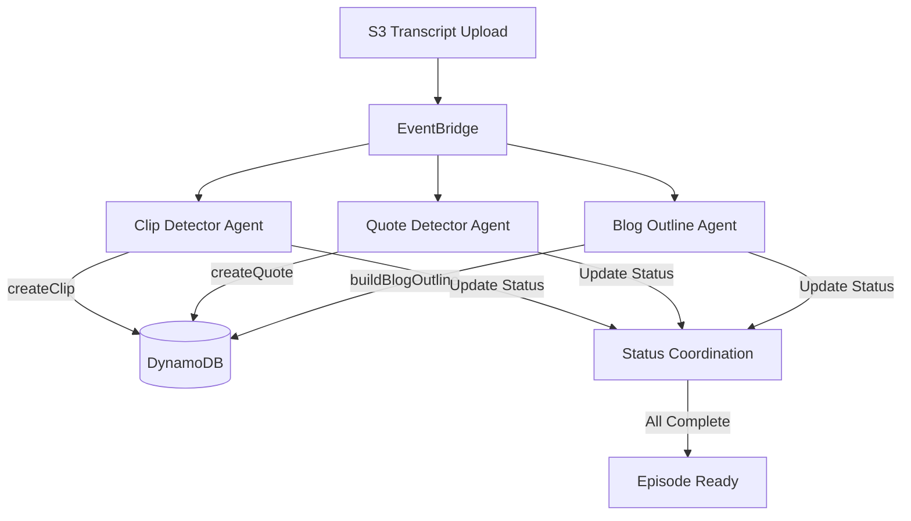

# Design Document: Agent Separation

## Overview

This design separates the monolithic clip-detector agent into three specialized, concurrent agents to improve content generation quality. Each agent focuses on a single task (clip detection, quote detection, or blog outline generation) and runs independently when a transcript is uploaded.

The key architectural change is moving from a single agent with multiple tools to three agents, each with a single tool. All three agents share the same EventBridge trigger pattern and use the same utilities for transcript loading and key parsing.

## Architecture



### Event Flow

1. User uploads transcript to S3
2. S3 emits ObjectCreated event to EventBridge
3. EventBridge triggers all three agents concurrently via separate Lambda invocations
4. Each agent:
   - Parses tenantId/episodeId from S3 key
   - Checks if content generation already completed (idempotency)
   - Loads transcript from S3
   - Loads episode metadata for context
   - Calls Bedrock with specialized prompt and single tool
   - Updates its completion status in DynamoDB
5. Last agent to complete updates episode status to Ready

## Components and Interfaces

### Clip Detector Agent (`functions/agents/clip-detector.mjs`)

Refactored to focus solely on clip detection.

```javascript
// Input: EventBridge S3 event
{
  detail: {
    object: { key: "tenant123/episode-uuid/transcript.srt" }
  }
}

// Tools: Only createClip
const tools = convertToBedrockTools([createClipTool]);

// Output: Creates clips in DynamoDB, updates agent status
```

### Quote Detector Agent (`functions/agents/quote-detector.mjs`)

New agent focused solely on quote detection.

```javascript
// Input: EventBridge S3 event (same as clip-detector)
{
  detail: {
    object: { key: "tenant123/episode-uuid/transcript.srt" }
  }
}

// Tools: Only createQuote
const tools = convertToBedrockTools([createQuoteTool]);

// Output: Creates quotes in DynamoDB, updates agent status
```

### Blog Outline Agent (`functions/agents/blog-outline-agent.mjs`)

New agent focused solely on blog outline generation.

```javascript
// Input: EventBridge S3 event (same as clip-detector)
{
  detail: {
    object: { key: "tenant123/episode-uuid/transcript.srt" }
  }
}

// Tools: Only buildBlogOutline
const tools = convertToBedrockTools([buildBlogOutlineTool]);

// Output: Creates blog outline in DynamoDB, updates agent status
```

### Status Coordination

Each agent tracks its own completion status in the episode metadata using a new `agentStatus` field:

```javascript
// Episode metadata structure
{
  pk: "tenant123#episode-uuid",
  sk: "metadata",
  agentStatus: {
    clipDetector: { status: "Completed", completedAt: "2025-01-15T10:30:00Z" },
    quoteDetector: { status: "Completed", completedAt: "2025-01-15T10:31:00Z" },
    blogOutline: { status: "In Progress", startedAt: "2025-01-15T10:30:00Z" }
  },
  workflowSteps: {
    generateContent: { status: "In Progress" }
  }
}
```

### Shared Utilities

All agents reuse existing utilities:
- `parseEpisodeIdFromKey` from `functions/utils/clips.mjs`
- `loadTranscript` from `functions/utils/transcripts.mjs`
- `updateWorkflowStepStatus` from `functions/utils/workflow-steps.mjs`
- `converse` from `functions/utils/agents.mjs`
- `convertToBedrockTools` from `functions/utils/tools.mjs`

### New Utility: Agent Status Coordination

```javascript
// functions/utils/agent-status.mjs

export const AGENT_TYPES = {
  CLIP_DETECTOR: 'clipDetector',
  QUOTE_DETECTOR: 'quoteDetector',
  BLOG_OUTLINE: 'blogOutline'
};

export const AGENT_STATUS = {
  IN_PROGRESS: 'In Progress',
  COMPLETED: 'Completed',
  FAILED: 'Failed'
};

// Update individual agent status
export async function updateAgentStatus(tenantId, episodeId, agentType, status, error = null);

// Check if all agents have completed
export async function checkAllAgentsComplete(tenantId, episodeId);

// Check if content generation already completed (for idempotency)
export async function isContentGenerationComplete(tenantId, episodeId);
```

## Data Models

### Agent Status Schema

```javascript
// Added to episode metadata
agentStatus: {
  clipDetector: {
    status: 'In Progress' | 'Completed' | 'Failed',
    startedAt: string,      // ISO timestamp
    completedAt?: string,   // ISO timestamp (when completed/failed)
    error?: string          // Error message (when failed)
  },
  quoteDetector: {
    status: 'In Progress' | 'Completed' | 'Failed',
    startedAt: string,
    completedAt?: string,
    error?: string
  },
  blogOutline: {
    status: 'In Progress' | 'Completed' | 'Failed',
    startedAt: string,
    completedAt?: string,
    error?: string
  }
}
```

### DynamoDB Update Pattern

Each agent uses conditional updates to safely update its own status:

```javascript
await ddb.send(new UpdateItemCommand({
  TableName: process.env.TABLE_NAME,
  Key: marshall({ pk: `${tenantId}#${episodeId}`, sk: 'metadata' }),
  UpdateExpression: 'SET #agentStatus.#agentType = :status, #updatedAt = :now',
  ExpressionAttributeNames: {
    '#agentStatus': 'agentStatus',
    '#agentType': agentType,
    '#updatedAt': 'updatedAt'
  },
  ExpressionAttributeValues: marshall({
    ':status': { status: 'Completed', completedAt: now },
    ':now': now
  })
}));
```

## Correctness Properties

*A property is a characteristic or behavior that should hold true across all valid executions of a system-essentially, a formal statement about what the system should do. Properties serve as the bridge between human-readable specifications and machine-verifiable correctness guarantees.*

### Property Reflection

After analyzing the acceptance criteria, I identified the following redundancies:
- Properties 1.3, 2.3, and 3.3 all test independent status tracking - these can be combined into a single property about agent status isolation
- Properties 6.1, 6.2, and 6.3 test workflow step coordination - these are distinct enough to remain separate

### Property 1: Agent Status Isolation

*For any* agent status update, updating one agent's status SHALL NOT modify any other agent's status in the agentStatus object.

**Validates: Requirements 1.3, 2.3, 3.3**

### Property 2: Fault Isolation

*For any* agent failure, the failure of one agent SHALL NOT prevent other agents from completing their processing successfully.

**Validates: Requirements 4.2**

### Property 3: Completion Coordination

*For any* episode, the GENERATE_CONTENT workflow step SHALL be set to Completed if and only if all three agents have status Completed.

**Validates: Requirements 4.3, 6.2**

### Property 4: Failure Propagation

*For any* episode where at least one agent has status Failed, the GENERATE_CONTENT workflow step SHALL be set to Failed.

**Validates: Requirements 6.3**

### Property 5: Idempotency

*For any* episode where GENERATE_CONTENT workflow step is already Completed, invoking any agent SHALL result in early return without processing.

**Validates: Requirements 6.4**

### Property 6: In Progress Initialization

*For any* agent that starts processing, if the GENERATE_CONTENT workflow step is not already In Progress or Completed, it SHALL be set to In Progress.

**Validates: Requirements 6.1**

## Error Handling

### Individual Agent Failures

Each agent handles its own errors independently:

1. Catch error in try/catch block
2. Update own agent status to Failed with error message
3. Check if this is the last agent to complete
4. If all agents have reported (some may have succeeded), update workflow step appropriately
5. Re-throw error for Lambda error handling

### Partial Success Handling

If some agents succeed and others fail:
- Successful agents' outputs (clips, quotes, outlines) are preserved
- Workflow step is marked as Failed
- Error message indicates which agent(s) failed
- User can retry failed agents or proceed with partial content

### Idempotency

All agents check if content generation is already complete before processing:

```javascript
const workflowSteps = episodeMeta?.workflowSteps || {};
if (workflowSteps[WORKFLOW_STEPS.GENERATE_CONTENT]?.status === 'Completed') {
  logger.info('Content generation already completed, skipping processing');
  return { statusCode: 200, message: 'Content already generated' };
}
```

## Testing Strategy

### Unit Testing

- Mock AWS SDK clients (DynamoDB, Bedrock)
- Test each agent's handler in isolation
- Verify correct tool configuration for each agent
- Test status update logic
- Test idempotency checks

### Property-Based Testing

Use fast-check library for property-based tests:

1. **Agent Status Isolation**: Generate random agent status updates and verify no cross-contamination
2. **Completion Coordination**: Generate all combinations of agent statuses and verify correct workflow step status
3. **Idempotency**: Generate episodes with various workflow step states and verify early return behavior

### Integration Testing

- Test concurrent agent execution with real EventBridge triggers
- Verify all three agents process the same transcript
- Test failure scenarios with one or more agents failing
- Verify final episode status after all agents complete

## SAM Template Changes

### New Lambda Functions

```yaml
QuoteDetectorFunction:
  Type: AWS::Serverless::Function
  Properties:
    Handler: functions/agents/quote-detector.handler
    Runtime: nodejs22.x
    Timeout: 300
    MemorySize: 1024
    Environment:
      Variables:
        TABLE_NAME: !Ref encoreTable
        BUCKET_NAME: !Ref TranscriptBucket
        MODEL_ID: amazon.nova-pro-v1:0
    Events:
      TranscriptUploaded:
        Type: EventBridgeRule
        Properties:
          Pattern:
            source: [aws.s3]
            detail-type: [Object Created]
            detail:
              bucket:
                name: [!Ref TranscriptBucket]
              object:
                key:
                  - suffix: .srt

BlogOutlineAgentFunction:
  Type: AWS::Serverless::Function
  Properties:
    Handler: functions/agents/blog-outline-agent.handler
    Runtime: nodejs22.x
    Timeout: 300
    MemorySize: 1024
    Environment:
      Variables:
        TABLE_NAME: !Ref encoreTable
        BUCKET_NAME: !Ref TranscriptBucket
        MODEL_ID: amazon.nova-pro-v1:0
    Events:
      TranscriptUploaded:
        Type: EventBridgeRule
        Properties:
          Pattern:
            source: [aws.s3]
            detail-type: [Object Created]
            detail:
              bucket:
                name: [!Ref TranscriptBucket]
              object:
                key:
                  - suffix: .srt
```

### Updated Clip Detector Function

Remove buildBlogOutline and createQuote tools, keep only createClip tool.


