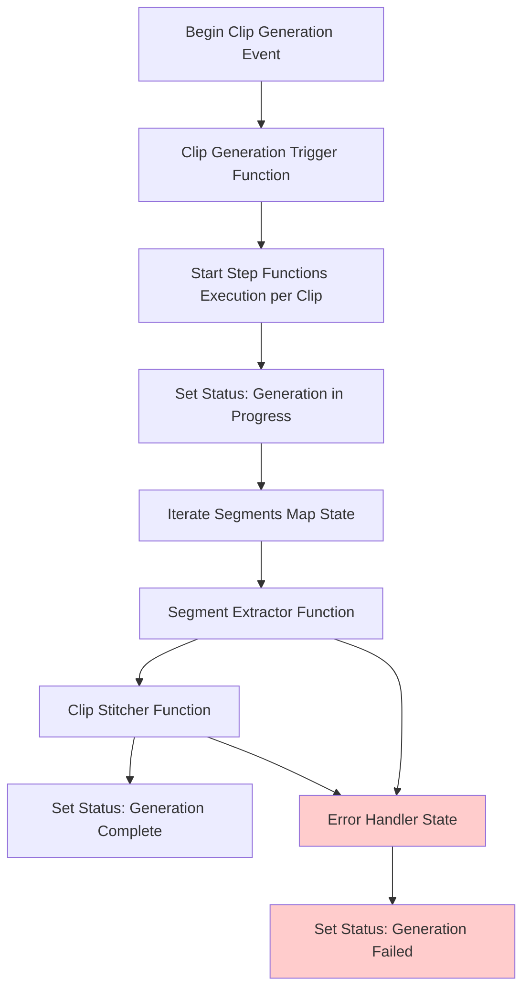
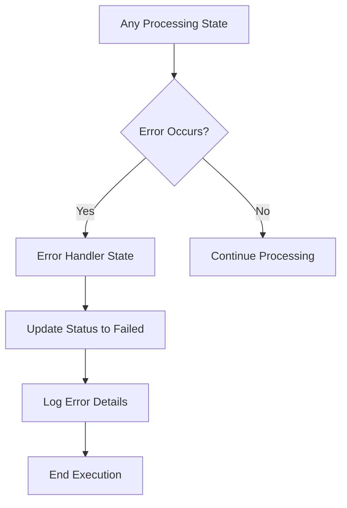

# Design Document

## Overview

This design improves the existing clip-generation workflow by fixing syntax errors, adding comprehensive error handling, simplifying the segment extractor function, removing the update-clip-record Lambda f in favor of direct DynamoDB integrations, and adding an event-driven trigger function. The solution focuses on reliability, simplicity, and maintainability.

## Architecture

### High-Level Flow



### Event-Driven Architecture

The workflow is triggered by EventBridge events, ensuring loose coupling and scalability:

1. **AI Clip Detection** publishes "Begin Clip Generation" event
2. **Clip Generation Trigger** receives event and starts workflows
3. **Step Functions** orchestrates clip assembly for each clip
4. **Direct DynamoDB Integration** updates status without Lambda overhead

## Components and Interfaces

### 1. Clip Generation Trigger Function

**Purpose**: Subscribe to Begin Clip Generation events and start Step Functions executions

**Input Event Structure**:
```json
{
  "source": "nullcheck.clips",
  "detail-type": "Begin Clip Generation",
  "detail": {
    "tenantId": "tenant-123",
    "episodeId": "episode-456"
  }
}
```

**Function Logic**:
- Parse EventBridge event to extract episode and clip data
- Validate required fields (tenantId, episodeId, clips)
- Start Step Functions execution for each clip with proper input structure
- Handle errors gracefully with detailed logging

### 2. Updated Step Functions Workflow

**Key Improvements**:
- Fixed JSONata syntax errors
- Proper environment variable references
- Direct DynamoDB integrations
- Comprehensive error handling
- Single-segment processing model

**Workflow States**:

#### Set In Progress State
```json
{
  "Type": "Task",
  "Resource": "arn:aws:states:::dynamodb:updateItem",
  "Parameters": {
    "TableName.$": "$.tableName",
    "Key": {
      "pk": {"S.$": "$.tenantId + '#' + $.episodeId"},
      "sk": {"S.$": "'clip#' + $.clipId"}
    },
    "UpdateExpression": "SET #statusHistory = list_append(if_not_exists(#statusHistory, :emptyList), :newStatus), #status = :status, #updatedAt = :updatedAt",
    "ExpressionAttributeNames": {
      "#statusHistory": "statusHistory",
      "#status": "status",
      "#updatedAt": "updatedAt"
    },
    "ExpressionAttributeValues": {
      ":status": {"S": "Generation in Progress"},
      ":newStatus": {"L": [{"M": {
        "status": {"S": "Generation in Progress"},
        "timestamp": {"S.$": "$$.State.EnteredTime"}
      }}]},
      ":updatedAt": {"S.$": "$$.State.EnteredTime"},
      ":emptyList": {"L": []}
    }
  }
}
```

#### Iterate Segments Map State
- Process each segment individually using Map state
- Pass single segment to Segment Extractor
- Collect results for final stitching

#### Error Handler State
```json
{
  "Type": "Task",
  "Resource": "arn:aws:states:::dynamodb:updateItem",
  "Parameters": {
    "TableName.$": "$.tableName",
    "Key": {
      "pk": {"S.$": "$.tenantId + '#' + $.episodeId"},
      "sk": {"S.$": "'clip#' + $.clipId"}
    },
    "UpdateExpression": "SET #statusHistory = list_append(#statusHistory, :failureStatus), #status = :status, #updatedAt = :updatedAt, #processingError = :error",
    "ExpressionAttributeNames": {
      "#statusHistory": "statusHistory",
      "#status": "status",
      "#updatedAt": "updatedAt",
      "#processingError": "processingError"
    },
    "ExpressionAttributeValues": {
      ":status": {"S": "Generation Failed"},
      ":failureStatus": {"L": [{"M": {
        "status": {"S": "Generation Failed"},
        "timestamp": {"S.$": "$$.State.EnteredTime"},
        "error": {"S.$": "$.Error.Cause"}
      }}]},
      ":updatedAt": {"S.$": "$$.State.EnteredTime"},
      ":error": {"M": {
        "message": {"S.$": "$.Error.Cause"},
        "timestamp": {"S.$": "$$.State.EnteredTime"}
      }}
    }
  }
}
```

### 3. Simplified Segment Extractor Function

**Key Changes**:
- Accept single segment instead of array
- Simplified input validation
- Focused error handling
- Cleaner return structure

**Input Structure**:
```json
{
  "tenantId": "tenant-123",
  "episodeId": "episode-456",
  "clipId": "clip-789",
  "segment": {
    "startTime": "00:15:30",
    "endTime": "00:17:45",
    "speaker": "host",
    "text": "Transcript segment text"
  }
}
```

**Output Structure**:
```json
{
  "episodeId": "episode-456",
  "clipId": "clip-789",
  "segmentFile": "episode-456/clips/clip-789/segments/0.mp4",
  "status": "completed",
  "metadata": {
    "duration": 135.5,
    "fileSize": 15728640,
    "resolution": "1920x1080"
  }
}
```

### 4. Clip Stitcher Function (Minimal Changes)

**Input Structure** (Updated):
```json
{
  "tenantId": "tenant-123",
  "episodeId": "episode-456",
  "clipId": "clip-789",
  "segments": [
    {
      "segmentFile": "episode-456/clips/clip-789/segments/0.mp4",
      "metadata": {...}
    }
  ]
}
```

## Data Models

### Clip Entity Status History

The status history will track all state transitions:

```json
{
  "pk": "tenant-123#episode-456",
  "sk": "clip#clip-789",
  "status": "Generation Complete",
  "statusHistory": [
    {
      "status": "detected",
      "timestamp": "2025-01-15T10:30:00Z"
    },
    {
      "status": "Generation in Progress",
      "timestamp": "2025-01-15T10:35:00Z"
    },
    {
      "status": "Generation Complete",
      "timestamp": "2025-01-15T10:42:00Z"
    }
  ],
  "s3Key": "episode-456/clips/clip-789/clip.mp4",
  "fileSize": 45728640,
  "duration": "00:02:15",
  "updatedAt": "2025-01-15T10:42:00Z"
}
```

### Error Handling Data Model

For failed clips:

```json
{
  "status": "Generation Failed",
  "statusHistory": [
    {
      "status": "Generation Failed",
      "timestamp": "2025-01-15T10:40:00Z",
      "error": "FFmpeg processing failed: Invalid input format"
    }
  ],
  "processingError": {
    "message": "FFmpeg processing failed: Invalid input format",
    "timestamp": "2025-01-15T10:40:00Z",
    "code": "FFMPEG_ERROR"
  }
}
```

## Error Handling

### Step Functions Error Handling

Each state includes comprehensive error handling:

1. **Lambda Function Errors**: Caught and routed to error handler
2. **DynamoDB Errors**: Retried with exponential backoff
3. **Timeout Errors**: Handled with appropriate status updates
4. **Validation Errors**: Logged and marked as failed

### Error State Transitions



### Retry Strategies

- **Lambda Invocations**: 3 retries with exponential backoff
- **DynamoDB Operations**: 3 retries with jitter
- **S3 Operations**: Built-in SDK retries
- **Step Functions**: No automatic retries at workflow level

## Testing Strategy

### Unit Testing

1. **Clip Generation Trigger Function**:
   - Test EventBridge event parsing
   - Test Step Functions execution initiation
   - Test error handling for malformed events

2. **Segment Extractor Function**:
   - Test single segment processing
   - Test input validation
   - Test FFmpeg integration with mocked operations

3. **Step Functions Workflow**:
   - Test state transitions with mock data
   - Test error handling paths
   - Test DynamoDB integration syntax

### Integration Testing

1. **End-to-End Workflow**:
   - Test complete clip generation flow
   - Test error scenarios and recovery
   - Test concurrent clip processing

2. **EventBridge Integration**:
   - Test event publishing and consumption
   - Test event filtering and routing

### Performance Testing

1. **Concurrent Processing**: Test multiple clips processing simultaneously
2. **Large Segments**: Test processing of long video segments
3. **Error Recovery**: Test system behavior under various failure conditions

## Deployment Considerations

### SAM Template Updates

1. **New Lambda Function**: Add Clip Generation Trigger function
2. **EventBridge Rules**: Add rule for Begin Clip Generation events
3. **Step Functions**: Update state machine definition
4. **IAM Permissions**: Update roles for direct DynamoDB access

### Environment Variables

- `TABLE_NAME`: DynamoDB table name for clip records
- `BUCKET_NAME`: S3 bucket for video storage
- `STATE_MACHINE_ARN`: Step Functions state machine ARN

### Monitoring and Observability

1. **CloudWatch Metrics**: Track workflow success/failure rates
2. **X-Ray Tracing**: Trace execution across all components
3. **Structured Logging**: Consistent logging format across functions
4. **Alarms**: Set up alarms for high error rates or timeouts
