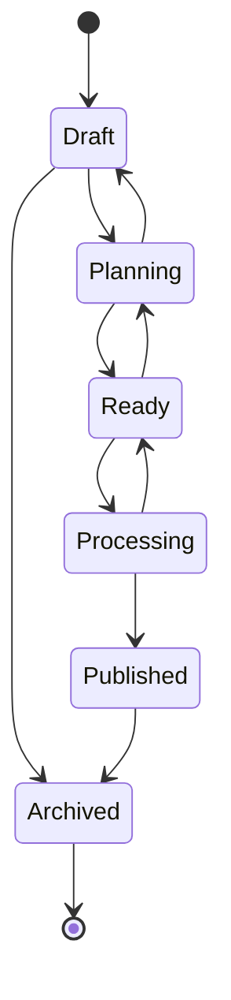
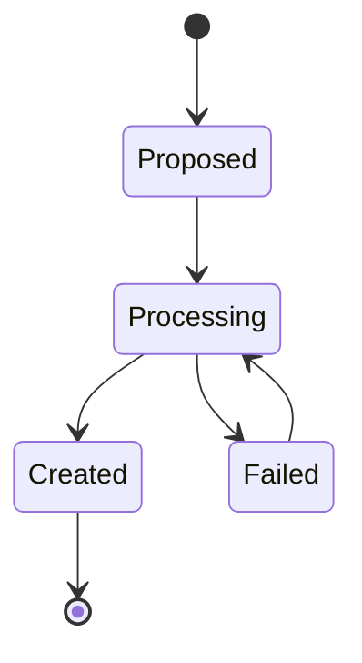
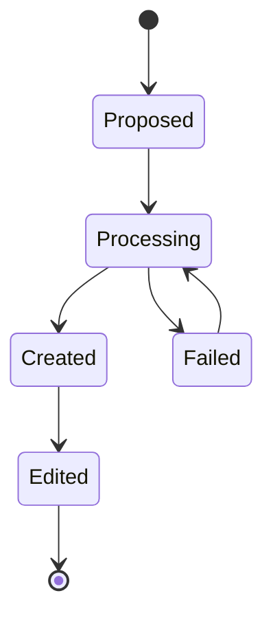
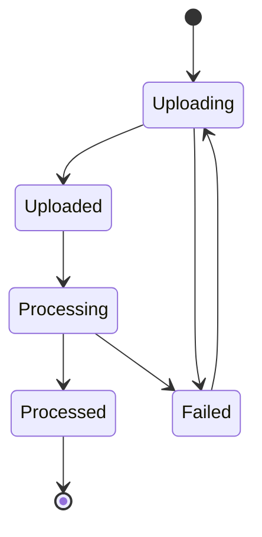
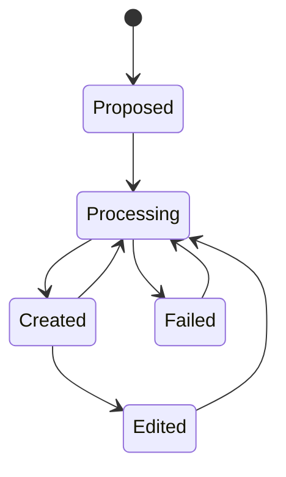
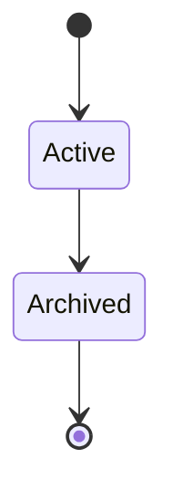
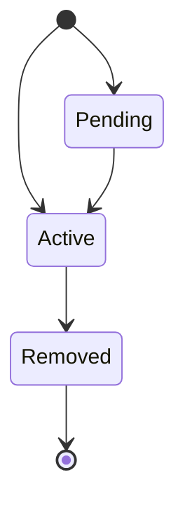
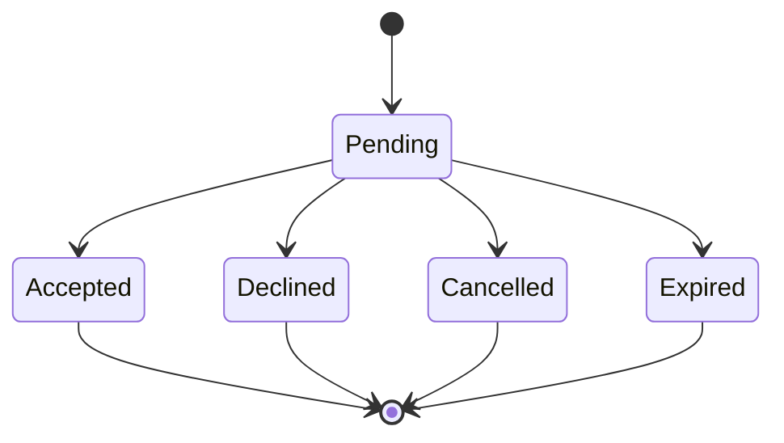

# Status Progression Diagrams

This document provides visual representations of status progressions for all entity types in the system.

## Episode Status Progression



**Episode Statuses:**
- **Draft**: Initial state when episode is created
- **Planning**: Episode has plan/outline added
- **Ready**: Episode is ready for clip generation
- **Processing**: Episode is being processed for clips
- **Published**: Episode content has been published
- **Archived**: Episode is archived and no longer active

## Clip Status Progression



**Clip Statuses:**
- **Proposed**: AI detected potential clip
- **Processing**: Clip video is being generated
- **Created**: Clip video successfully created
- **Failed**: Clip generation failed

## Quote Status Progression



**Quote Statuses:**
- **Proposed**: AI detected potential quote
- **Processing**: Quote graphic is being generated
- **Created**: Quote graphic successfully created
- **Failed**: Quote graphic generation failed
- **Edited**: Quote has been manually edited

## Track Status Progression



**Track Statuses:**
- **Uploading**: Multipart upload in progress
- **Uploaded**: Upload completed successfully
- **Processing**: Video preprocessing (chunking) in progress
- **Processed**: Video preprocessing completed
- **Failed**: Upload or processing failed

## Blog Status Progression



**Blog Statuses:**
- **Proposed**: Blog outline created
- **Processing**: Blog content being generated
- **Created**: Blog content successfully generated
- **Failed**: Blog generation failed
- **Edited**: Blog content manually edited

## Team Status Progression



**Team Statuses:**
- **Active**: Team is active and operational
- **Archived**: Team is archived and inactive

## Membership Status Progression



**Membership Statuses:**
- **Pending**: Invitation sent, awaiting acceptance
- **Active**: Member is active in team
- **Removed**: Member removed from team

## Invitation Status Progression



**Invitation Statuses:**
- **Pending**: Invitation sent, awaiting response
- **Accepted**: Invitation accepted by recipient
- **Declined**: Invitation declined by recipient
- **Cancelled**: Invitation cancelled by sender
- **Expired**: Invitation expired (TTL-based)

## Status Transition Validation

All status transitions are validated using the `*_STATUS_TRANSITIONS` maps exported from each schema file. Invalid transitions will result in a validation error.

Example validation:
```javascript
import { EPISODE_STATUS_TRANSITIONS } from '@schemas/episodes';

const validateTransition = (currentStatus, newStatus) => {
  const allowedTransitions = EPISODE_STATUS_TRANSITIONS[currentStatus] || [];
  if (!allowedTransitions.includes(newStatus)) {
    throw new Error(`Invalid transition from ${currentStatus} to ${newStatus}`);
  }
};
```
