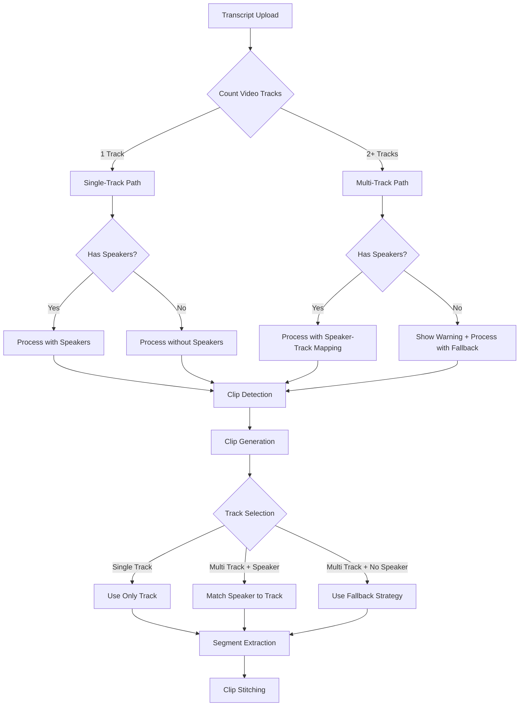

# Design Document

## Overview

This feature makes speaker attribution optional in transcripts by intelligently adapting the clip generation workflow based on the number of video tracks uploaded. For single-track episodes, speannecessary since all segments come from the same video source. For multi-track episodes, the system provides clear guidance about speaker requirements while implementing graceful fallback behavior when speakers are missing.

The design maintains backward compatibility with existing speaker-based workflows while removing friction for the common single-track use case. The solution focuses on smart defaults, clear user communication, and resilient processing logic that degrades gracefully rather than failing.

## Architecture

### Decision Flow



### Component Interactions

```
┌─────────────────────────────────────────────────────────────┐
│                     Frontend UI Layer                        │
├─────────────────────────────────────────────────────────────┤
│  • Track count display                                       │
│  • Speaker requirement indicator                             │
│  • Transcript upload with optional speaker guidance          │
│  • Clip quality warnings for multi-track without speakers    │
└────────────────────┬────────────────────────────────────────┘
                     │
                     v
┌─────────────────────────────────────────────────────────────┐
│                  Episode Metadata Layer                      │
├─────────────────────────────────────────────────────────────┤
│  • trackCount: number of uploaded tracks                     │
│  • hasSpeakers: boolean flag for speaker attribution         │
│  • speakers: array of detected speaker names                 │
└────────────────────┬────────────────────────────────────────┘
                     │
                     v
┌─────────────────────────────────────────────────────────────┐
│                  Clip Detector Agent                         │
├─────────────────────────────────────────────────────────────┤
│  • Generates clips with nullable speaker fields              │
│  • Includes speaker attribution status in response           │
│  • Provides guidance based on track count                    │
└────────────────────┬────────────────────────────────────────┘
                     │
                     v
┌─────────────────────────────────────────────────────────────┐
│                  Segment Extractor                           │
├─────────────────────────────────────────────────────────────┤
│  • Checks track count before speaker matching                │
│  • Single track: uses only track regardless of speaker       │
│  • Multi track + speaker: matches speaker to track           │
│  • Multi track + no speaker: uses fallback strategy          │
│  • Records selection method in metadata                      │
└─────────────────────────────────────────────────────────────┘
```

## Components and Interfaces

### Enhanced Episode Metadata

**New Fields**:
```javascript
{
  // Existing fields...
  trackCount: 1,  // Number of uploaded video tracks
  hasSpeakers: false,  // Whether transcript has speaker attribution
  speakers: [],  // Array of detected speaker names (empty if no speakers)
  // Existing fields...
}
```

**Update Triggers**:
- `trackCount`: Updated when tracks are uploaded or deleted
- `hasSpeakers`: Updated when transcript is processed
- `speakers`: Updated when transcript with speakers is processed

### Modified Clip Schema

**Segment Speaker Field**:
```javascript
{
  segments: [
    {
      startTime: "00:15:30",
      endTime: "00:17:45",
      speaker: "Allen",  // Can be null for single-track or missing attribution
      order: 1,
      transcript: "Did you know agents could do this?"
    }
  ]
}
```

**Validation Changes**:
- `speaker` field changes from required to optional
- Validation passes with `speaker: null`
- No breaking changes to existing clips with speakers

### Enhanced Segment Extractor

**Track Selection Logic**:
```javascript
const selectTrackForSegment = async (segment, episodeId, tenantId) => {
  const tracks = await getEpisodeTracks(episodeId, tenantId);

  // Single track: always use it
  if (tracks.length === 1) {
    return {
      trackName: tracks[0].trackName,
      matchType: 'single-track-default',
      confidence: 1.0,
      reasoning: 'Only one track available'
    };
  }

  // Multi-track with speaker: match speaker to track
  if (segment.speaker) {
    const match = await matchSpeakerToTrack(
      episodeId,
      segment.speaker,
      tracks
    );

    if (match.matched) {
      return {
        trackName: match.trackName,
        matchType: 'speaker-matched',
        matchedSpeaker: match.matchedSpeaker,
        confidence: match.confidence,
        reasoning: match.reasoning
      };
    }
  }

  // Fallback: use first track or main track
  const fallbackTrack = tracks.find(t => t.trackName === 'main') || tracks[0];
  return {
    trackName: fallbackTrack.trackName,
    matchType: 'fallback',
    confidence: 0.5,
    reasoning: segment.speaker
      ? `No track match found for speaker "${segment.speaker}"`
      : 'No speaker attribution available',
    warning: 'Using fallback track selection - results may not be optimal'
  };
};
```

### Updated Clip Detector Agent

**System Prompt Changes**:
```javascript
const systemPrompt = `
// ... existing prompt ...

### Speaker Attribution (Optional)

Speaker attribution in the transcript is OPTIONAL:

**Single-track episodes**: Speakers are not required. All segments will use the single available video track.

**Multi-track episodes**: Speakers are RECOMMENDED for optimal track selection:
- When speakers are present: Each segment will be extracted from the correct speaker's video track
- When speakers are missing: All segments will use a fallback track (typically "main")

**Your task**: Generate clips based on content quality, regardless of speaker attribution. Include speaker names in segments when they are present in the transcript, but omit them when not available.

// ... rest of prompt ...
`;
```

**Response Enhancement**:
```javascript
// After clip generation, add context about speaker attribution
const trackCount = episodeMeta?.trackCount || 0;
const hasSpeakers = episodeMeta?.hasSpeakers || false;

let speakerGuidance = '';
if (trackCount === 1) {
  speakerGuidance = hasSpeakers
    ? 'Speaker attribution detected and preserved for reference.'
    : 'No speaker attribution needed for single-track episode.';
} else if (trackCount > 1) {
  speakerGuidance = hasSpeakers
    ? 'Speaker attribution will be used for optimal track selection.'
    : 'Warning: Multiple tracks available but no speaker attribution. Clips will use fallback track selection.';
}

return {
  message: response,
  speakerGuidance,
  trackCount,
  hasSpeakers
};
```

### Frontend UI Components

**Episode Overview - Track Status**:
```typescript
interface TrackStatusProps {
  trackCount: number;
  hasSpeakers: boolean;
  speakers: string[];
}

const TrackStatus: React.FC<TrackStatusProps> = ({ trackCount, hasSpeakers, speakers }) => {
  if (trackCount === 0) {
    return <EmptyState message="No video tracks uploaded yet" />;
  }

  if (trackCount === 1) {
    return (
      <div className="track-status success">
        <CheckIcon />
        <span>Single track - speaker attribution optional</span>
      </div>
    );
  }

  if (hasSpeakers) {
    return (
      <div className="track-status success">
        <CheckIcon />
        <span>{trackCount} tracks with speaker attribution</span>
        <div className="speakers-list">
          {speakers.map(s => <span key={s} className="speaker-badge">{s}</span>)}
        </div>
      </div>
    );
  }

  return (
    <div className="track-status warning">
      <WarningIcon />
      <span>{trackCount} tracks without speaker attribution</span>
      <p className="help-text">
        For optimal clip quality, add speaker labels to your transcript.
        Speakers help match segments to the correct video track.
      </p>
      <button onClick={showSpeakerGuide}>Learn how to add speakers</button>
    </div>
  );
};
```

**Transcript Upload - Speaker Guidance**:
```typescript
const TranscriptUploadGuidance: React.FC<{ trackCount: number }> = ({ trackCount }) => {
  if (trackCount === 1) {
    return (
      <div className="guidance-box info">
        <InfoIcon />
        <p>
          Your episode has one video track. Speaker labels are optional but can be
          included for reference.
        </p>
      </div>
    );
  }

  if (trackCount > 1) {
    return (
      <div className="guidance-box warning">
        <WarningIcon />
        <p>
          Your episode has {trackCount} video tracks. For best results, include speaker
          labels in your transcript to match segments to the correct video track.
        </p>
        <details>
          <summary>How to add speaker labels</summary>
          <pre>
{`1
00:00:20,925 --> 00:00:27,104
Allen: Sometimes it's a breakthrough

2
00:00:28,000 --> 00:00:30,500
Andres: We try it out live`}
          </pre>
        </details>
      </div>
    );
  }

  return null;
};
```

**Clip List - Quality Indicators**:
```typescript
interface ClipQualityIndicatorProps {
  clip: Clip;
  trackCount: number;
  hasSpeakers: boolean;
}

const ClipQualityIndicator: React.FC<ClipQualityIndicatorProps> = ({
  clip,
  trackCount,
  hasSpeakers
}) => {
  // Single track: always optimal
  if (trackCount === 1) {
    return null;  // No indicator needed
  }

  // Multi-track with speakers: check if all segments have speakers
  if (hasSpeakers) {
    const allSegmentsHaveSpeakers = clip.segments.every(s => s.speaker);
    if (allSegmentsHaveSpeakers) {
      return (
        <div className="quality-indicator success">
          <CheckIcon />
          <span>Optimal track selection</span>
        </div>
      );
    }
  }

  // Multi-track without speakers or missing speakers in segments
  return (
    <div className="quality-indicator warning">
      <WarningIcon />
      <span>Using fallback track selection</span>
      <Tooltip content="Some segments may not use the optimal video track. Add speaker labels to your transcript for better results." />
    </div>
  );
};
```

## Data Models

### Episode Metadata Updates

```javascript
{
  pk: "tenant123#episode-id",
  sk: "metadata",
  // ... existing fields ...
  trackCount: 2,  // NEW: Number of uploaded tracks
  hasSpeakers: true,  // NEW: Whether transcript has speakers
  speakers: ["Allen", "Andres"],  // UPDATED: Can be empty array
  // ... existing fields ...
}
```

### Clip Segment Schema Updates

```javascript
{
  pk: "tenant123#episode-id",
  sk: "data#clip#clip-id",
  segments: [
    {
      startTime: "00:15:30",
      endTime: "00:17:45",
      speaker: "Allen",  // UPDATED: Can be null
      order: 1,
      transcript: "Did you know agents could do this?"
    },
    {
      startTime: "00:41:01",
      endTime: "00:41:05",
      speaker: null,  // UPDATED: Null is valid
      order: 2,
      transcript: "This segment has no speaker"
    }
  ]
}
```

### Track Selection Metadata

```javascript
{
  // Stored in segment processing results
  trackSelection: {
    trackName: "main",
    matchType: "single-track-default" | "speaker-matched" | "fallback",
    matchedSpeaker: "Allen",  // null for non-speaker-matched
    confidence: 1.0,  // 0.0-1.0
    reasoning: "Only one track available",
    warning: null  // Set for fallback cases
  }
}
```

## Correctness Properties

*A property is a characteristic or behavior that should hold true across all valid executions of a system-essentially, a formal statement about what the system should do. Properties serve as the bridge between human-readable specifications and machine-verifiable correctness guarantees.*

### Property 1: Single-track episodes never require speakers

*For any* episode with exactly one video track, clip generation should succeed regardless of whether the transcript contains speaker attribution.
**Validates: Requirements 1.1, 1.2, 1.3**

### Property 2: Track count accuracy

*For any* episode, the trackCount field should always equal the number of uploaded video tracks with status "uploaded" or "processed".
**Validates: Requirements 8.1, 8.2, 8.3**

### Property 3: Speaker detection consistency

*For any* transcript, if any SRT entry contains speaker attribution in the format "Name: text", then hasSpeakers should be true.
**Validates: Requirements 8.1, 8.2**

### Property 4: Segment speaker nullability

*For any* clip segment, the speaker field can be null without causing validation errors or processing failures.
**Validates: Requirements 3.2, 3.3, 3.4, 3.5**

### Property 5: Single-track selection determinism

*For any* episode with exactly one track, all clip segments should use that track regardless of speaker attribution.
**Validates: Requirements 1.3, 4.2**

### Property 6: Fallback track consistency

*For any* multi-track episode without speaker attribution, all segments within a single clip should use the same fallback track.
**Validates: Requirements 6.3, 6.4**

### Property 7: Track selection method recording

*For any* processed segment, the track selection metadata should include matchType, confidence, and reasoning fields.
**Validates: Requirements 4.5, 6.2, 6.4**

### Property 8: Speaker-track mapping preservation

*For any* multi-track episode with speaker attribution, segments with speakers should attempt speaker-to-track matching before fallback.
**Validates: Requirements 2.1, 4.1**

### Property 9: Graceful degradation

*For any* clip processing operation, missing speaker information should result in fallback behavior, not errors or failures.
**Validates: Requirements 6.1, 6.2**

### Property 10: Re-processing with updated speakers

*For any* episode where a transcript is re-uploaded with added speaker attribution, existing clips should be re-processable with updated track selections.
**Validates: Requirements 7.3, 7.4, 7.5**

## Error Handling

### Missing Speaker in Multi-Track Scenario

**Behavior**:
- Log warning with segment details
- Apply fallback track selection
- Record fallback in segment metadata
- Include warning in clip processing results
- Do not fail the operation

**User Communication**:
- Display warning badge on clip
- Provide tooltip explaining fallback behavior
- Suggest adding speaker labels for improvement
- Link to speaker attribution guide

### Track Count Mismatch

**Scenario**: Episode metadata shows trackCount but actual tracks differ

**Behavior**:
- Recalculate trackCount from actual tracks
- Update episode metadata
- Log discrepancy for monitoring
- Continue processing with correct count

### Speaker-Track Mapping Failure

**Scenario**: Speaker name doesn't match any track speakers

**Behavior**:
- Log failed match attempt with speaker name
- Use LLM-based fuzzy matching as fallback
- If fuzzy match fails, use default fallback track
- Record all attempts in segment metadata

## Testing Strategy

### Unit Testing

**Track Selection Logic**:
- Test single-track selection (always uses only track)
- Test multi-track with speaker (matches to correct track)
- Test multi-track without speaker (uses fallback)
- Test fallback consistency across segments
- Test track count calculation
- Test speaker detection in transcripts

**Metadata Updates**:
- Test trackCount updates on track upload/delete
- Test hasSpeakers detection from transcript
- Test speakers array extraction
- Test metadata consistency

**Schema Validation**:
- Test clip creation with null speakers
- Test clip creation with speakers
- Test mixed segments (some with speakers, some without)

### Integration Testing

**Single-Track Workflow**:
- Upload single track
- Upload transcript without speakers
- Verify clip generation succeeds
- Verify all segments use single track
- Verify no speaker warnings displayed

**Multi-Track with Speakers Workflow**:
- Upload multiple tracks with speaker assignments
- Upload transcript with speaker attribution
- Verify clip generation succeeds
- Verify segments match to correct tracks
- Verify optimal quality indicators displayed

**Multi-Track without Speakers Workflow**:
- Upload multiple tracks
- Upload transcript without speakers
- Verify clip generation succeeds with warnings
- Verify fallback track selection
- Verify warning indicators displayed
- Verify guidance provided to user

**Re-Upload with Speakers**:
- Upload transcript without speakers
- Generate clips
- Re-upload same transcript with speakers added
- Verify clips are re-processed
- Verify track selections updated
- Verify quality indicators updated

### Property-Based Testing

The testing framework will use **fast-check** for JavaScript property-based testing. Each property test should run a minimum of 100 iterations.

**Property Test 1: Single-track determinism**
- Generate random episodes with one track
- Generate random transcripts with/without speakers
- Process clips
- Verify all segments use the single track
- **Validates: Property 1, Property 5**

**Property Test 2: Track count accuracy**
- Generate random number of tracks
- Calculate trackCount
- Verify trackCount equals actual track count
- **Validates: Property 2**

**Property Test 3: Speaker detection**
- Generate random transcripts with varying speaker formats
- Detect speakers
- Verify hasSpeakers flag matches presence of speakers
- **Validates: Property 3**

**Property Test 4: Segment nullability**
- Generate random clips with null and non-null speakers
- Validate schemas
- Process segments
- Verify no errors occur
- **Validates: Property 4**

**Property Test 5: Fallback consistency**
- Generate multi-track episodes without speakers
- Process multiple segments
- Verify all segments use same fallback track
- **Validates: Property 6**

## Configuration

### Environment Variables

**No new environment variables required**

All configuration uses existing environment variables:
- `TABLE_NAME`: DynamoDB table
- `BUCKET_NAME`: S3 bucket for transcripts
- `MODEL_ID`: AI model for clip detection

### Feature Flags

**Optional Feature Flags** (for gradual rollout):
```javascript
const FEATURE_FLAGS = {
  SPEAKER_OPTIONAL_WORKFLOW: true,  // Enable speaker-optional processing
  SHOW_TRACK_QUALITY_INDICATORS: true,  // Show quality indicators in UI
  ENABLE_SPEAKER_GUIDANCE: true  // Show speaker attribution guidance
};
```

## Deployment Considerations

### Database Migration

**No schema migration required**:
- New fields (trackCount, hasSpeakers) are additive
- Existing episodes without these fields will calculate them on-demand
- Nullable speaker fields are backward compatible

**Backfill Strategy**:
```javascript
// Run once to backfill existing episodes
const backfillEpisodeMetadata = async (episodeId, tenantId) => {
  const tracks = await getEpisodeTracks(episodeId, tenantId);
  const trackCount = tracks.length;

  const episode = await getEpisode(episodeId, tenantId);
  const hasSpeakers = episode.speakers && episode.speakers.length > 0;

  await updateEpisode(episodeId, tenantId, {
    trackCount,
    hasSpeakers
  });
};
```

### Gradual Rollout

**Phase 1**: Backend changes
- Deploy updated segment extractor with fallback logic
- Deploy updated clip detector with optional speakers
- Deploy metadata updates for trackCount and hasSpeakers

**Phase 2**: Frontend changes
- Deploy track status indicators
- Deploy speaker guidance components
- Deploy quality indicators for clips

**Phase 3**: User communication
- Add in-app guidance about speaker attribution
- Update documentation
- Send email to existing users explaining changes

### Backward Compatibility

**Existing Episodes**:
- Episodes with speakers continue working unchanged
- Episodes without trackCount/hasSpeakers calculate on-demand
- No breaking changes to existing clips

**API Compatibility**:
- All existing API endpoints remain unchanged
- New fields are optional in responses
- Clients can ignore new fields

## Performance Optimization

### Caching Track Count

**Strategy**: Cache track count in episode metadata to avoid repeated queries

**Implementation**:
```javascript
// Update trackCount when tracks change
const onTrackUpload = async (episodeId, tenantId) => {
  const tracks = await getEpisodeTracks(episodeId, tenantId);
  await updateEpisode(episodeId, tenantId, {
    trackCount: tracks.length
  });
};

const onTrackDelete = async (episodeId, tenantId) => {
  const tracks = await getEpisodeTracks(episodeId, tenantId);
  await updateEpisode(episodeId, tenantId, {
    trackCount: tracks.length
  });
};
```

### Optimizing Track Selection

**Single-Track Fast Path**:
```javascript
// Skip expensive speaker matching for single-track episodes
if (trackCount === 1) {
  return tracks[0];  // Immediate return
}

// Only do speaker matching for multi-track
return await matchSpeakerToTrack(speaker, tracks);
```

### Reducing UI Re-renders

**Memoization**:
```typescript
const TrackStatus = React.memo<TrackStatusProps>(({ trackCount, hasSpeakers, speakers }) => {
  // Component implementation
}, (prev, next) => {
  return prev.trackCount === next.trackCount &&
         prev.hasSpeakers === next.hasSpeakers &&
         JSON.stringify(prev.speakers) === JSON.stringify(next.speakers);
});
```

## Monitoring and Observability

### CloudWatch Metrics

**Custom Metrics**:
- `SingleTrackEpisodes`: Count of episodes with one track
- `MultiTrackEpisodes`: Count of episodes with multiple tracks
- `EpisodesWithSpeakers`: Count of episodes with speaker attribution
- `EpisodesWithoutSpeakers`: Count of episodes without speakers
- `FallbackTrackSelections`: Count of segments using fallback selection
- `SpeakerMatchSuccessRate`: Percentage of successful speaker-to-track matches

### Logging

**Track Selection Logging**:
```javascript
logger.info('Track selection completed', {
  episodeId,
  segmentOrder,
  speaker: segment.speaker || 'none',
  trackCount,
  selectedTrack: selection.trackName,
  matchType: selection.matchType,
  confidence: selection.confidence
});
```

**Fallback Logging**:
```javascript
logger.warn('Using fallback track selection', {
  episodeId,
  segmentOrder,
  speaker: segment.speaker || 'none',
  trackCount,
  fallbackTrack: selection.trackName,
  reasoning: selection.reasoning
});
```

### Alarms

**Recommended Alarms**:
- High fallback selection rate (> 30% of segments)
- Track count calculation failures
- Speaker detection failures
- Clip processing failures due to track selection

## User Experience Flow

### Single-Track Episode (Optimal Path)

1. User uploads single video track
2. System sets trackCount = 1
3. User uploads transcript (with or without speakers)
4. System detects speakers (if present) but doesn't require them
5. Clip detector generates clips
6. All segments automatically use single track
7. User sees "Single track - speaker attribution optional" status
8. No warnings or quality indicators needed

### Multi-Track Episode with Speakers (Optimal Path)

1. User uploads multiple video tracks with speaker assignments
2. System sets trackCount = 2+
3. User uploads transcript with speaker attribution
4. System detects speakers and sets hasSpeakers = true
5. Clip detector generates clips with speakers
6. Segments match to correct tracks via speaker-track mapping
7. User sees "X tracks with speaker attribution" status
8. Quality indicators show "Optimal track selection"

### Multi-Track Episode without Speakers (Degraded Path)

1. User uploads multiple video tracks
2. System sets trackCount = 2+
3. User uploads transcript without speakers
4. System detects no speakers and sets hasSpeakers = false
5. System shows warning: "For optimal results, add speaker labels"
6. User can proceed or add speakers
7. If proceeding: Clip detector generates clips without speakers
8. Segments use fallback track selection
9. User sees warning indicators on clips
10. User can re-upload transcript with speakers to improve quality

### Adding Speakers Later

1. User has multi-track episode without speakers
2. User sees quality warnings on clips
3. User clicks "Learn how to add speakers"
4. System shows speaker attribution guide
5. User re-uploads transcript with speakers added
6. System detects speakers and updates hasSpeakers = true
7. System triggers clip re-processing
8. Segments update to use correct tracks
9. Quality indicators update to show "Optimal track selection"
10. User receives notification of improved clip quality

