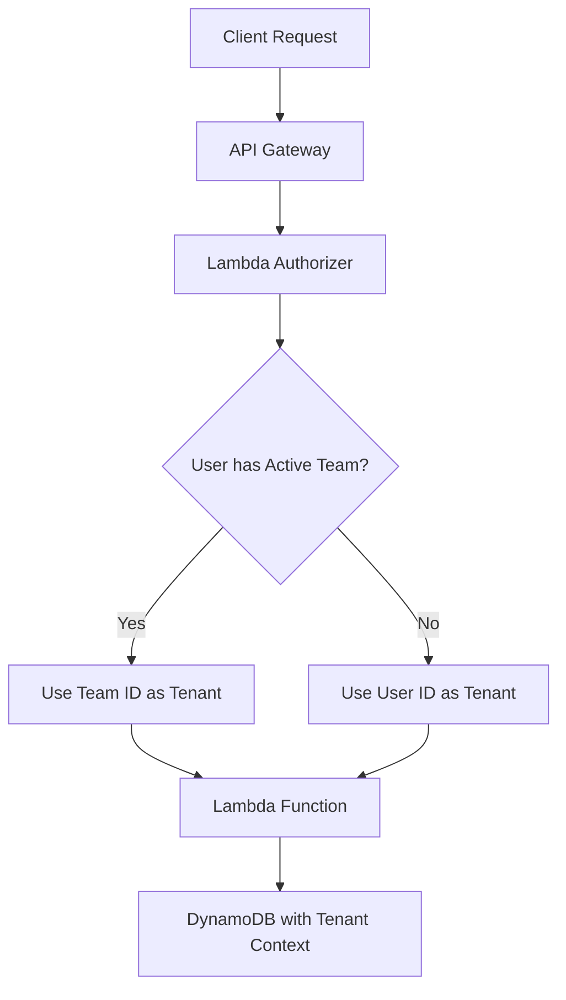

# Team Management Design

## Overview

The team management feature extends the existing single-tenant architecture to support multi-user collaboration through teams. The design maintains backward compatibility with individual usage while adding team-based data isolation and context switching. Teams function as collaborative workspaces where multiple users can work on shared episodes and clips.

## Architecture

### Core Concepts

The system introduces a **tenant context res** pattern where the effective tenant ID is determined by:
1. **Individual Mode**: User's own ID serves as tenant context (existing behavior)
2. **Team Mode**: Active team ID serves as tenant context (new behavior)

This approach ensures all existing data access patterns continue to work while enabling team collaboration through a simple context switch.

### Data Flow



## Components and Interfaces

### 1. Authentication Layer

#### Enhanced Authorizer
The existing authorizer (`functions/auth/authorizer.mjs`) will be enhanced to:
- Fetch user profile to determine active team
- Resolve effective tenant ID (user ID or active team ID)
- Include team context in authorization response

```javascript
// Enhanced authorizer context
{
  tenantId: "team-123" | "user-456",  // Effective tenant
  userId: "user-456",                 // Always the actual user
  activeTeamId: "team-123" | null,    // Current team context
  email: "user@example.com"
}
```

#### Token Invalidation
When users switch team context, their tokens must be invalidated to clear the authorizer cache. This will be handled through:
- Cognito user attribute updates that change token claims
- Force token refresh on team context changes

### 2. Team Management Functions

#### Team CRUD Operations
- `functions/teams/create-team.mjs` - Create new team
- `functions/teams/list-teams.mjs` - List user's teams
- `functions/teams/get-team.mjs` - Get team details
- `functions/teams/update-team.mjs` - Update team information
- `functions/teams/delete-team.mjs` - Delete team and cleanup

### 3. User Profile Management

#### Profile Functions
- `functions/users/get-profile.mjs` - Get user profile
- `functions/users/update-profile.mjs` - Update user profile
- `functions/users/set-active-team.mjs` - Switch team context

## Data Validation Patterns

### Inline Validation in Lambda Handlers
Following the existing codebase patterns, validation is done directly in each Lambda handler:

```javascript
// Example from create-team.mjs handler
export const handler = async (event) => {
  try {
    const data = parseBody(event);
    if (data === null) {
      return formatResponse(400, { message: 'Invalid request' });
    }

    // Inline validation - no abstraction
    const errors = [];
    const name = (data?.name ?? '').toString().trim();

    if (!name) errors.push('name is required');
    if (name.length > 100) errors.push('name must be 100 characters or less');

    const description = data?.description ? String(data.description) : undefined;
    if (description && description.length > 500) errors.push('description must be 500 characters or less');

    if (errors.length) {
      return formatResponse(400, { message: errors.join(', ') });
    }

    // Continue with business logic...
  } catch (err) {
    // Error handling
  }
};
```

**Approach:**
- Validation logic directly in each handler function
- No separate validation functions or utilities
- Follow exact pattern from `create-episode.mjs`
- Simple error arrays joined into response messages
- No abstraction layers or helper functions

## Data Models

### Team Entity

#### Team Metadata
```json
{
  "pk": "team#123e4567-e89b-12d3-a456-426614174000",
  "sk": "metadata",
  "GSI1PK": "teams",
  "GSI1SK": "2025-01-15T10:30:00Z#123e4567-e89b-12d3-a456-426614174000",
  "name": "Content Team Alpha",
  "description": "Main content creation team",
  "ownerId": "user-456",
  "status": "active|archived",
  "settings": {
    "defaultPlatforms": ["twitch", "youtube"],
    "timezone": "America/New_York"
  },
  "createdAt": "2025-01-15T10:30:00Z",
  "updatedAt": "2025-01-15T10:30:00Z"
}
```

### User Profile Entity

#### User Profile
```json
{
  "pk": "user#456e7890-e89b-12d3-a456-426614174001",
  "sk": "profile",
  "email": "user@example.com",
  "name": "John Doe",
  "activeTeamId": "team-123",
  "preferences": {
    "timezone": "America/New_York",
    "notifications": true
  },
  "teams": [
    {
      "teamId": "team-123",
      "role": "owner",
      "joinedAt": "2025-01-15T10:30:00Z"
    }
  ],
  "createdAt": "2025-01-15T10:30:00Z",
  "updatedAt": "2025-01-15T10:35:00Z"
}
```

### Access Patterns

#### Team Operations
- **Get team by ID**: `pk = team#{teamId}` AND `sk = metadata`
- **List user's teams**: Query user profile and extract team memberships

#### User Operations
- **Get user profile**: `pk = user#{userId}` AND `sk = profile`
- **Update active team**: Update user profile with new `activeTeamId`

## Error Handling

### Team Access Control
- **403 Forbidden**: User not a member of requested team
- **404 Not Found**: Team doesn't exist or user has no access
- **409 Conflict**: Duplicate team membership or team name conflicts

### Profile Management
- **400 Bad Request**: Invalid team ID in active team setting
- **422 Unprocessable Entity**: User not a member of team they're trying to activate

### Token Invalidation
- **401 Unauthorized**: Token invalidated due to team context change
- **403 Forbidden**: Team context changed, re-authentication required

## Testing Strategy

### Unit Tests
- Team CRUD operations with proper access control
- User profile management and team context switching
- Authorizer logic for tenant context resolution
- Data validation for team and user entities

### Security Tests
- Verify team data isolation
- Test unauthorized access attempts
- Validate token invalidation on context changes
- Confirm proper tenant context resolution

## API Endpoints

### Team Management
```
GET    /teams                    # List user's teams
POST   /teams                    # Create new team
GET    /teams/{teamId}           # Get team details
PUT    /teams/{teamId}           # Update team
DELETE /teams/{teamId}           # Delete team
```

### User Profile
```
GET    /me                       # Get user profile
PUT    /me                       # Update user profile
POST   /me/teams                 # Set active team
```

## Security Considerations

### Data Isolation
- All existing functions automatically inherit team-based isolation through tenant context
- No changes required to episode/clip functions - they use the resolved tenant ID
- Team membership validation occurs at the API layer

### Access Control
- Team owners can manage team settings and membership
- Team members can access team resources but cannot modify team settings
- Users can only switch to teams where they are members

### Token Security
- Active team changes invalidate existing tokens
- Authorizer cache cleared on team context switches
- Re-authentication required after team changes

## Migration Strategy

### Backward Compatibility
- Existing users continue to work in individual mode
- No changes to existing data or API contracts
- Team features are additive, not replacing existing functionality

### Deployment Approach
1. Deploy new team management functions
2. Update authorizer to support team context resolution
3. Add user profile management endpoints
4. Enable team features in client applications

### Data Migration
- No existing data migration required
- User profiles created on first access
- Teams created through new API endpoints
- Existing episodes/clips remain in individual tenant context

## Performance Considerations

### Authorizer Optimization
- Cache user profile lookups within authorizer execution
- Minimize DynamoDB calls for team membership validation
- Use efficient query patterns for team access checks

### Database Efficiency
- Single table design maintains performance characteristics
- GSI usage for team listing and chronological queries
- Batch operations for team membership management

### Caching Strategy
- Authorizer results cached by API Gateway (invalidated on team changes)
- User profile caching within Lambda execution context
- Team membership caching for frequently accessed teams
