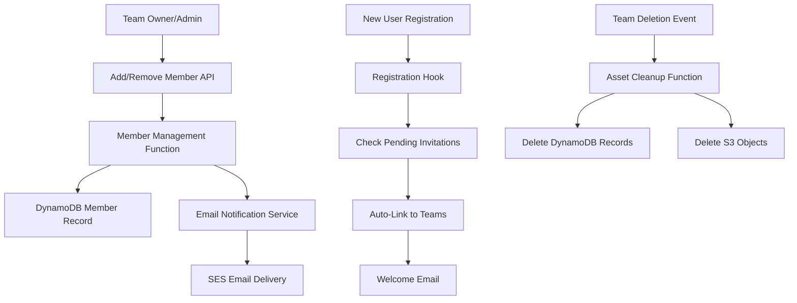
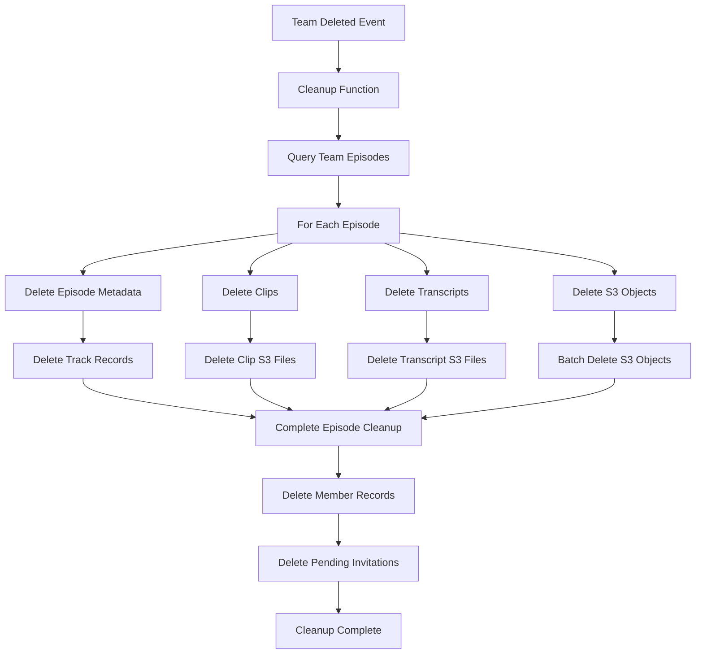

# Team Member Management Design

## Overview

The team member management feature extends the existing team management system to provide comprehensive member lifecycle management, role-based permissions, email notifications, and automated cleanup processes. The design builds upon the existing team infrastructure while adding new capabilities for member operations, email integration, and asset cleanup triggered by the existing "Team Deleted" event.

## Architecture

### Core Components

The system introduces several new components while leveraging existing infrastructure:

1. **Member Management Functions**: CRUD operations for team membership
2. **Email Notification Service**: Automated email delivery for team events
3. **Registration Hook**: Auto-linking during user registration
4. **Asset Cleanup Service**: Complete team data removal on deletion
5. **Role-Based Access Control**: Enhanced permissions system

### Data Flow



### Event-Driven Architecture

The system leverages EventBridge for asynchronous processing:
- **Team Member Added**: Triggers email notifications
- **Team Member Removed**: Triggers email notifications and cleanup
- **Team Deleted**: Triggers comprehensive asset cleanup
- **User Registered**: Triggers auto-linking check

## Components and Interfaces

### 1. Member Management Functions

#### Add Team Member
**Function**: `functions/teams/add-member.mjs`
- Validates requester has administrator or owner role
- Creates team membership record with specified role
- Publishes "Team Member Added" event for email notification
- Handles duplicate membership prevention

#### Remove Team Member
**Function**: `functions/teams/remove-member.mjs`
- Validates requester has administrator or owner role
- Removes team membership record
- Clears user's active team if it matches removed team
- Publishes "Team Member Removed" event for email notification

#### List Team Members
**Function**: `functions/teams/list-members.mjs`
- Returns paginated list of team members
- Includes role information and join dates
- Shows pending invitations to owners/administrators only
- Validates team membership for access

#### Update Member Role
**Function**: `functions/teams/update-member-role.mjs`
- Validates only owners can change roles
- Updates member role (administrator/member)
- Prevents owners from changing their own role
- Publishes "Team Member Role Updated" event

### 2. Email Notification System

#### Email Service
**Function**: `functions/events/send-team-email.mjs`
- Processes team-related events from EventBridge
- Sends appropriate email templates based on event type
- Handles email delivery failures gracefully
- Logs email delivery status for monitoring

#### Email Templates
- **Team Invitation**: Welcome new members with team details
- **Team Removal**: Notify removed members
- **Role Change**: Notify members of role updates
- **Team Welcome**: Confirm auto-linked memberships

### 3. Registration Integration

#### Registration Hook
**Function**: `functions/auth/post-confirmation.mjs`
- Triggered by Cognito post-confirmation
- Checks for pending invitations by email
- Auto-links user to invited teams
- Sends welcome email for auto-linked teams
- Removes pending invitation records

### 4. Asset Cleanup System

#### Team Asset Cleanup
**Function**: `functions/events/cleanup-team-assets.mjs`
- Triggered by "Team Deleted" EventBridge event
- Identifies all team episodes and clips
- Deletes DynamoDB records for team assets
- Removes S3 objects for team content
- Cleans up member records and pending invitations

### 5. Enhanced User Profile

#### Enhanced Profile Endpoint
**Function**: `functions/users/get-profile.mjs` (enhanced)
- Includes role information for each team membership
- Shows team hierarchy (owned vs member teams)
- Maintains backward compatibility
- Efficient querying of team roles

## Data Models

### Team Membership Entity

#### Team Member Record (Existing Structure)
```json
{
  "pk": "team#123e4567-e89b-12d3-a456-426614174000",
  "sk": "user#456e7890-e89b-12d3-a456-426614174001",
  "GSI1PK": "user#456e7890-e89b-12d3-a456-426614174001#teams",
  "GSI1SK": "2025-01-15T10:30:00Z#123e4567-e89b-12d3-a456-426614174000",
  "userId": "456e7890-e89b-12d3-a456-426614174001",
  "teamId": "123e4567-e89b-12d3-a456-426614174000",
  "role": "owner|administrator|member",
  "status": "active|pending",
  "invitedBy": "user-789",
  "joinedAt": "2025-01-15T10:30:00Z",
  "createdAt": "2025-01-15T10:30:00Z",
  "updatedAt": "2025-01-15T10:30:00Z"
}
```

### Pending Invitation Entity

#### Invitation Record
```json
{
  "pk": "invitation#email@example.com",
  "sk": "team#123e4567-e89b-12d3-a456-426614174000",
  "GSI1PK": "team#123e4567-e89b-12d3-a456-426614174000",
  "GSI1SK": "invitation#email@example.com",
  "email": "email@example.com",
  "teamId": "123e4567-e89b-12d3-a456-426614174000",
  "teamName": "Content Team Alpha",
  "role": "administrator|member",
  "invitedBy": "user-789",
  "inviterName": "John Doe",
  "status": "pending",
  "expiresAt": "2025-02-15T10:30:00Z",
  "ttl": 1645024200,
  "createdAt": "2025-01-15T10:30:00Z"
}
```

### Enhanced User Profile

#### Updated User Profile
```json
{
  "pk": "user#456e7890-e89b-12d3-a456-426614174001",
  "sk": "profile",
  "email": "user@example.com",
  "name": "John Doe",
  "activeTeamId": "team-123",
  "preferences": {
    "timezone": "America/New_York",
    "notifications": true
  },
  "teams": [
    {
      "teamId": "team-123",
      "role": "owner",
      "joinedAt": "2025-01-15T10:30:00Z"
    },
    {
      "teamId": "team-456",
      "role": "administrator",
      "joinedAt": "2025-01-16T14:20:00Z"
    },
    {
      "teamId": "team-789",
      "role": "member",
      "joinedAt": "2025-01-17T09:15:00Z"
    }
  ],
  "createdAt": "2025-01-15T10:30:00Z",
  "updatedAt": "2025-01-15T10:35:00Z"
}
```

### Access Patterns

#### Team Member Operations
- **Get team members**: `pk = team#{teamId}` AND `sk` begins with `user#`
- **Get user's teams**: GSI1 query with `GSI1PK = user#{userId}#teams`
- **Check team membership**: `pk = team#{teamId}` AND `sk = user#{userId}`

#### Invitation Management
- **Get pending invitations by email**: `pk = invitation#{email}`
- **Get team invitations**: GSI1 query with `GSI1PK = team#{teamId}` AND `GSI1SK` begins with `invitation#`

## Role-Based Access Control

### Permission Matrix

| Operation | Owner | Administrator | Member |
|-----------|-------|---------------|--------|
| Add Members | ✅ | ✅ | ❌ |
| Remove Members | ✅ | ✅ | ❌ |
| Change Roles | ✅ | ❌ | ❌ |
| View Members | ✅ | ✅ | ✅ |
| View Pending Invitations | ✅ | ✅ | ❌ |
| Delete Team | ✅ | ❌ | ❌ |
| Update Team Settings | ✅ | ❌ | ❌ |
| Access Team Episodes/Clips | ✅ | ✅ | ✅ |

### Permission Validation

```javascript
// Permission check utility
const hasPermission = (userRole, operation) => {
  const permissions = {
    'add_member': ['owner', 'administrator'],
    'remove_member': ['owner', 'administrator'],
    'change_role': ['owner'],
    'view_members': ['owner', 'administrator', 'member'],
    'view_invitations': ['owner', 'administrator'],
    'delete_team': ['owner'],
    'update_team': ['owner']
  };

  return permissions[operation]?.includes(userRole) || false;
};
```

## Email Integration

### Amazon SES Configuration

#### Email Templates
- **Team Invitation Template**: Professional invitation with team details and next steps
- **Member Removal Template**: Polite notification of team removal
- **Role Change Template**: Notification of permission changes
- **Welcome Template**: Confirmation of auto-linked team membership

#### Email Content Structure
```json
{
  "templateName": "team-invitation",
  "templateData": {
    "teamName": "Content Team Alpha",
    "inviterName": "John Doe",
    "role": "administrator",
    "loginUrl": "https://app.example.com/login",
    "teamUrl": "https://app.example.com/teams/123"
  }
}
```

### Email Delivery Handling

#### Retry Logic
- **Immediate retry**: For temporary SES failures
- **Exponential backoff**: For rate limiting
- **Dead letter queue**: For permanent failures
- **Monitoring**: CloudWatch metrics for delivery rates

## Asset Cleanup Architecture

### Cleanup Process Flow



### Cleanup Implementation Strategy

#### Batch Processing
- **DynamoDB**: Use batch delete operations for efficiency
- **S3**: Use batch delete API for multiple objects
- **Pagination**: Handle large datasets with pagination
- **Error Handling**: Continue cleanup on individual failures

#### Cleanup Scope
- **Episodes**: All episode metadata and related records
- **Clips**: All clip records and S3 video files
- **Transcripts**: All transcript records and S3 files
- **Tracks**: All video track records and S3 files
- **Members**: All team membership records
- **Invitations**: All pending invitation records

## Error Handling

### Member Management Errors

#### Validation Errors
- **Invalid Email**: Proper email format validation
- **Duplicate Membership**: Prevent adding existing members
- **Invalid Role**: Validate role values (owner/administrator/member)
- **Self-Operation**: Prevent owners from removing themselves

#### Permission Errors
- **Insufficient Privileges**: Clear error messages for unauthorized operations
- **Team Not Found**: Handle non-existent team references
- **User Not Found**: Handle invalid user references
- **Role Conflicts**: Prevent invalid role assignments

### Email Delivery Errors

#### Handling Strategies
- **Temporary Failures**: Retry with exponential backoff
- **Permanent Failures**: Log and continue operation
- **Rate Limiting**: Implement proper throttling
- **Invalid Addresses**: Validate email formats before sending

### Cleanup Errors

#### Recovery Mechanisms
- **Partial Failures**: Continue cleanup despite individual failures
- **Retry Logic**: Retry failed operations with backoff
- **Monitoring**: Alert on cleanup failures
- **Manual Recovery**: Provide tools for manual cleanup if needed

## Testing Strategy

### Unit Tests

#### Member Management
- Test role-based permission validation
- Test duplicate membership prevention
- Test member addition and removal workflows
- Test role update operations

#### Email Notifications
- Test email template rendering
- Test delivery failure handling
- Test event-driven email triggers
- Mock SES for unit testing

#### Asset Cleanup
- Test episode and clip identification
- Test S3 object deletion
- Test DynamoDB record cleanup
- Test error handling and recovery

### Integration Tests

#### End-to-End Workflows
- Complete member lifecycle (add → role change → remove)
- Auto-linking during user registration
- Team deletion with full asset cleanup
- Email delivery and notification workflows

#### Error Scenarios
- Permission denied operations
- Network failures during cleanup
- Email delivery failures
- Partial cleanup scenarios

## Security Considerations

### Access Control

#### API Security
- **Role Validation**: Verify permissions before operations
- **Team Membership**: Validate user belongs to team
- **Input Sanitization**: Sanitize all user inputs
- **Rate Limiting**: Prevent abuse of member operations

#### Data Protection
- **Email Privacy**: Protect email addresses in logs
- **Member Information**: Secure member data access
- **Audit Trail**: Log all member management operations
- **Data Retention**: Proper cleanup of sensitive data

### Email Security

#### SES Configuration
- **Domain Verification**: Verify sending domains
- **DKIM Signing**: Enable email authentication
- **Bounce Handling**: Process bounces and complaints
- **Reputation Management**: Monitor sending reputation

## Performance Considerations

### Database Optimization

#### Query Patterns
- **Efficient Indexes**: Use GSI for user team queries
- **Batch Operations**: Minimize DynamoDB calls
- **Pagination**: Handle large member lists efficiently
- **Connection Reuse**: Optimize Lambda performance

### Email Performance

#### Delivery Optimization
- **Template Caching**: Cache email templates
- **Batch Sending**: Group emails when possible
- **Async Processing**: Use EventBridge for email triggers
- **Rate Management**: Respect SES sending limits

### Cleanup Performance

#### Efficient Deletion
- **Parallel Processing**: Delete resources concurrently
- **Batch Operations**: Use batch APIs for efficiency
- **Progress Tracking**: Monitor cleanup progress
- **Timeout Handling**: Handle long-running operations

## Monitoring and Observability

### Metrics

#### Member Management Metrics
- **Member Operations**: Add/remove/role change rates
- **Permission Denials**: Unauthorized operation attempts
- **API Response Times**: Performance monitoring
- **Error Rates**: Operation failure tracking

#### Email Metrics
- **Delivery Rates**: Successful email delivery percentage
- **Bounce Rates**: Email bounce and complaint rates
- **Template Usage**: Email template utilization
- **Processing Times**: Email generation and sending times

#### Cleanup Metrics
- **Cleanup Duration**: Time to complete team asset cleanup
- **Success Rates**: Percentage of successful cleanups
- **Resource Counts**: Number of assets cleaned per team
- **Error Rates**: Cleanup operation failures

### Alerting

#### Critical Alerts
- **High Error Rates**: Member operation failures
- **Email Delivery Issues**: SES delivery problems
- **Cleanup Failures**: Failed team asset cleanup
- **Permission Violations**: Security-related alerts

## Migration and Deployment

### Backward Compatibility

#### Existing Functionality
- **Team Operations**: Maintain existing team CRUD operations
- **User Profiles**: Enhance without breaking existing clients
- **API Contracts**: Preserve existing endpoint behavior
- **Data Models**: Extend without modifying existing records

### Deployment Strategy

#### Phased Rollout
1. **Phase 1**: Deploy member management functions
2. **Phase 2**: Add email notification system
3. **Phase 3**: Implement registration hooks
4. **Phase 4**: Deploy asset cleanup system
5. **Phase 5**: Enable full feature set

#### Data Migration
- **No Breaking Changes**: All changes are additive
- **Role Assignment**: Existing team owners retain owner role
- **Member Records**: Create member records for existing team relationships
- **Invitation System**: New functionality, no migration needed

## Future Enhancements

### Advanced Features

#### Team Analytics
- **Member Activity**: Track member engagement
- **Usage Metrics**: Team resource utilization
- **Performance Insights**: Team productivity metrics

#### Enhanced Permissions
- **Custom Roles**: User-defined permission sets
- **Resource-Level Permissions**: Granular access control
- **Temporary Access**: Time-limited permissions

#### Integration Improvements
- **SSO Integration**: Single sign-on support
- **Directory Sync**: Active Directory integration
- **API Webhooks**: External system notifications
