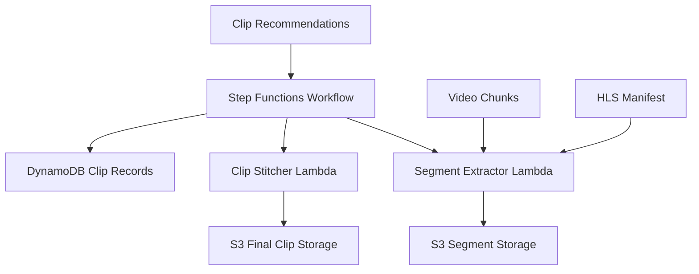
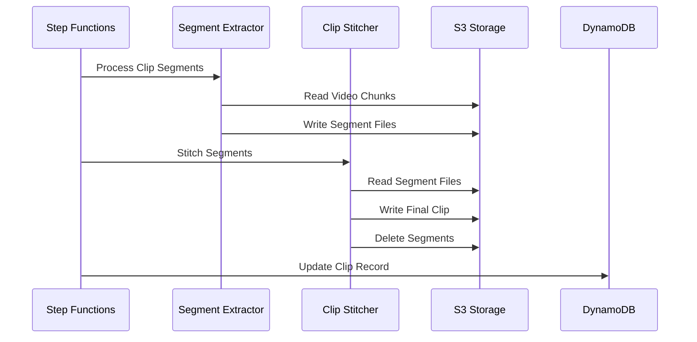

# Design Document

## Overview

The Video Clip Processing system implements an automated workflow that transforms AI-detected clip recommendations into processed video files. The system uses AWS Step Functions to orchestrate a multi-stage process that extracts video segments from pre-chunked video tracks, processes them with FFmpeg, and assembles final clips for social media distribution.

## Architecture

### High-Level Architecture



### Workflow Orchestration

The system uses AWS Step Functions to coordinate the clip processing pipeline:

1. **Initialization**: Parse clip recommendations and prepare processing context
2. **Parallel Processing**: Process multiple clips concurrently (up to 5)
3. **Segment Extraction**: Extract video segments for each clip
4. **Clip Assembly**: Stitch segments into final clips
5. **Cleanup**: Remove intermediate files and update records

### Data Flow



## Components and Interfaces

### Step Functions State Machine

#### State Machine Definition
```json
{
  "Comment": "Video Clip Processing Workflow",
  "StartAt": "InitializeProcessing",
  "States": {
    "InitializeProcessing": {
      "Type": "Pass",
      "Next": "ProcessClipsParallel"
    },
    "ProcessClipsParallel": {
      "Type": "Map",
      "ItemsPath": "$.clips",
      "MaxConcurrency": 5,
      "Iterator": {
        "StartAt": "ExtractSegments",
        "States": {
          "ExtractSegments": {
            "Type": "Task",
            "Resource": "arn:aws:lambda:${AWS::Region}:${AWS::AccountId}:function:SegmentExtractorFunction",
            "Retry": [
              {
                "ErrorEquals": ["States.TaskFailed"],
                "IntervalSeconds": 2,
                "MaxAttempts": 3,
                "BackoffRate": 2.0
              }
            ],
            "Next": "StitchClip"
          },
          "StitchClip": {
            "Type": "Task",
source": "arn:aws:lambda:${AWS::Region}:${AWS::AccountId}:function:ClipStitcherFunction",
            "Retry": [
              {
                "ErrorEquals": ["States.TaskFailed"],
                "IntervalSeconds": 2,
                "MaxAttempts": 3,
                "BackoffRate": 2.0
              }
            ],
            "Next": "UpdateClipRecord"
          },
          "UpdateClipRecord": {
            "Type": "Task",
            "Resource": "arn:aws:lambda:${AWS::Region}:${AWS::AccountId}:function:UpdateClipRecordFunction",
            "End": true
          }
        }
      },
      "End": true
    }
  }
}
```

#### Input Schema
```json
{
  "episodeId": "123e4567-e89b-12d3-a456-426614174000",
  "trackName": "main",
  "clips": [
    {
      "clipId": "clip-uuid",
      "segments": [
        {
          "startTime": "00:15:30",
          "endTime": "00:17:45"
        }
      ]
    }
  ]
}
```

### Segment Extractor Lambda Function

#### Function Configuration
- **Runtime**: Node.js 22.x
- **Memory**: 3008 MB (for FFmpeg processing)
- **Timeout**: 15 minutes
- **Architecture**: ARM64
- **Layers**: FFmpeg layer for video processing

#### Core Logic
```javascript
export const handler = async (event) => {
  const { episodeId, trackName, clipId, segments } = event;

  // 1. Load HLS manifest and segment index
  const manifest = await loadHlsManifest(episodeId, trackName);

  // 2. Calculate chunk mappings for each segment
  const chunkMappings = segments.map(segment =>
    calculateChunkMapping(segment, manifest.segments)
  );

  // 3. Extract video segments using FFmpeg
  const extractedSegments = await Promise.all(
    chunkMappings.map((mapping, index) =>
      extractSegment(mapping, index, episodeId, clipId)
    )
  );

  return {
    episodeId,
    clipId,
    segmentFiles: extractedSegments,
    totalSegments: segments.length
  };
};
```

#### Chunk Mapping Algorithm
```javascript
function calculateChunkMapping(segment, hlsSegments) {
  const startSeconds = timeToSeconds(segment.startTime);
  const endSeconds = timeToSeconds(segment.endTime);

  const relevantChunks = hlsSegments.filter(chunk =>
    chunk.start < endSeconds && chunk.end > startSeconds
  );

  return relevantChunks.map(chunk => ({
    s3Key: chunk.key,
    startOffset: Math.max(0, startSeconds - chunk.start),
    endOffset: Math.min(chunk.duration, endSeconds - chunk.start),
    duration: Math.min(chunk.duration, endSeconds - chunk.start) - Math.max(0, startSeconds - chunk.start)
  }));
}
```

### Clip Stitcher Lambda Function

#### Function Configuration
- **Runtime**: Node.js 22.x
- **Memory**: 3008 MB (for FFmpeg processing)
- **Timeout**: 10 minutes
- **Architecture**: ARM64
- **Layers**: FFmpeg layer for video processing

#### Core Logic
```javascript
export const handler = async (event) => {
  const { episodeId, clipId, segmentFiles } = event;

  // 1. Download segment files from S3
  const localSegments = await downloadSegments(segmentFiles);

  // 2. Create FFmpeg concat file
  const concatFile = createConcatFile(localSegments);

  // 3. Stitch segments using FFmpeg
  const outputFile = await stitchSegments(concatFile, clipId);

  // 4. Upload final clip to S3
  const clipS3Key = `${episodeId}/clips/${clipId}/clip.mp4`;
  await uploadClip(outputFile, clipS3Key);

  // 5. Clean up intermediate files
  await cleanupSegments(episodeId, clipId);

  return {
    episodeId,
    clipId,
    clipS3Key,
    fileSize: await getFileSize(outputFile)
  };
};
```

#### FFmpeg Processing
```javascript
async function stitchSegments(concatFile, clipId) {
  const outputFile = `/tmp/${clipId}_final.mp4`;

  const ffmpegCommand = [
    '-f', 'concat',
    '-safe', '0',
    '-i', concatFile,
    '-c', 'copy',
    '-avoid_negative_ts', 'make_zero',
    outputFile
  ];

  await execFFmpeg(ffmpegCommand);
  return outputFile;
}
```

### Update Clip Record Lambda Function

#### Function Configuration
- **Runtime**: Node.js 22.x
- **Memory**: 512 MB
- **Timeout**: 30 seconds
- **Architecture**: ARM64

#### Core Logic
```javascript
export const handler = async (event) => {
  const { episodeId, clipId, clipS3Key, fileSize } = event;

  const updateParams = {
    TableName: process.env.TABLE_NAME,
    Key: marshall({
      pk: episodeId,
      sk: `clip#${clipId}`
    }),
    UpdateExpression: 'SET #status = :status, #s3Key = :s3Key, #fileSize = :fileSize, #processedAt = :processedAt, #updatedAt = :updatedAt',
    ExpressionAttributeNames: {
      '#status': 'status',
      '#s3Key': 's3Key',
      '#fileSize': 'fileSize',
      '#processedAt': 'processedAt',
      '#updatedAt': 'updatedAt'
    },
    ExpressionAttributeValues: marshall({
      ':status': 'processed',
      ':s3Key': clipS3Key,
      ':fileSize': fileSize,
      ':processedAt': new Date().toISOString(),
      ':updatedAt': new Date().toISOString()
    })
  };

  await ddb.send(new UpdateItemCommand(updateParams));

  return { success: true };
};
```

## Data Models

### Enhanced Clip Entity

```json
{
  "pk": "123e4567-e89b-12d3-a456-426614174000",
  "sk": "clip#001",
  "GSI1PK": "clips",
  "GSI1SK": "2025-01-15T10:30:00Z#123e4567-e89b-12d3-a456-426614174000#001",
  "clipId": "clip-uuid",
  "title": "Interesting Discussion Point",
  "description": "AI-generated description of the clip content",
  "segments": [
    {
      "startTime": "00:15:30",
      "endTime": "00:17:45",
      "text": "Transcript text for this segment"
    }
  ],
  "status": "detected|processing|processed|failed|published",
  "s3Key": "123e4567-e89b-12d3-a456-426614174000/clips/clip-uuid/clip.mp4",
  "fileSize": 15728640,
  "duration": "00:02:15",
  "processingMetadata": {
    "segmentCount": 3,
    "totalProcessingTime": 45.2,
    "ffmpegVersion": "4.4.2"
  },
  "createdAt": "2025-01-15T10:40:00Z",
  "processedAt": "2025-01-15T10:42:15Z",
  "updatedAt": "2025-01-15T10:42:15Z"
}
```

### Processing State Entity

```json
{
  "pk": "processing#workflow-execution-id",
  "sk": "state",
  "episodeId": "123e4567-e89b-12d3-a456-426614174000",
  "trackName": "main",
  "totalClips": 5,
  "processedClips": 3,
  "failedClips": 0,
  "status": "running|completed|failed",
  "startedAt": "2025-01-15T10:40:00Z",
  "completedAt": "2025-01-15T10:45:30Z",
  "ttl": 1642248000
}
```

## Error Handling

### Retry Strategy

1. **Transient Errors**: Automatic retry with exponential backoff
   - Network timeouts
   - S3 throttling
   - Lambda cold starts

2. **Permanent Errors**: Immediate failure with detailed logging
   - Missing video chunks
   - Invalid timestamp formats
   - FFmpeg processing errors

### Error Recovery

```javascript
const retryConfig = {
  ErrorEquals: ["States.TaskFailed"],
  IntervalSeconds: 2,
  MaxAttempts: 3,
  BackoffRate: 2.0
};
```

### Failure Handling

- **Segment Extraction Failure**: Mark clip as failed, continue with other clips
- **Stitching Failure**: Retry with different FFmpeg parameters
- **S3 Upload Failure**: Retry with exponential backoff
- **DynamoDB Update Failure**: Log error but don't fail workflow

## Testing Strategy

### Unit Testing

#### Segment Extractor Tests
```javascript
describe('Segment Extractor', () => {
  test('should calculate correct chunk mappings', () => {
    const segment = { startTime: '00:01:30', endTime: '00:03:45' };
    const hlsSegments = mockHlsSegments();

    const mapping = calculateChunkMapping(segment, hlsSegments);

    expect(mapping).toHaveLength(2);
    expect(mapping[0].startOffset).toBe(30);
    expect(mapping[1].endOffset).toBe(45);
  });

  test('should handle segment spanning multiple chunks', () => {
    // Test implementation
  });
});
```

#### Clip Stitcher Tests
```javascript
describe('Clip Stitcher', () => {
  test('should create valid concat file', () => {
    const segments = ['segment1.mp4', 'segment2.mp4'];
    const concatFile = createConcatFile(segments);

    expect(concatFile).toContain('file segment1.mp4');
    expect(concatFile).toContain('file segment2.mp4');
  });
});
```

### Integration Testing

#### End-to-End Workflow Tests
```javascript
describe('Clip Processing Workflow', () => {
  test('should process single clip successfully', async () => {
    const input = {
      episodeId: 'test-episode',
      trackName: 'main',
      clips: [mockClipData()]
    };

    const result = await executeStepFunction(input);

    expect(result.status).toBe('SUCCEEDED');
    expect(result.output.processedClips).toBe(1);
  });
});
```

### Performance Testing

#### Load Testing
- Process 10 clips concurrently
- Measure processing time per clip
- Monitor Lambda memory usage
- Test S3 upload/download throughput

#### Stress Testing
- Process maximum concurrent clips (5)
- Test with large video files (>1GB)
- Validate timeout handling
- Monitor error rates

## Performance Considerations

### Lambda Optimization

1. **Memory Allocation**: 3008 MB for FFmpeg operations
2. **Timeout Configuration**: 15 minutes for segment extraction, 10 minutes for stitching
3. **Container Reuse**: Optimize for warm starts
4. **Parallel Processing**: Process segments concurrently where possible

### S3 Optimization

1. **Multipart Uploads**: For large clip files (>100MB)
2. **Transfer Acceleration**: Enable for faster uploads
3. **Intelligent Tiering**: Automatic cost optimization
4. **Lifecycle Policies**: Clean up intermediate files

### FFmpeg Optimization

1. **Hardware Acceleration**: Use ARM64 optimized builds
2. **Codec Selection**: H.264 for compatibility
3. **Quality Settings**: Balance quality vs. file size
4. **Processing Flags**: Optimize for speed

## Security Considerations

### IAM Permissions

#### Step Functions Role
```json
{
  "Version": "2012-10-17",
  "Statement": [
    {
      "Effect": "Allow",
      "Action": [
        "lambda:InvokeFunction"
      ],
      "Resource": [
        "arn:aws:lambda:*:*:function:SegmentExtractorFunction",
        "arn:aws:lambda:*:*:function:ClipStitcherFunction",
        "arn:aws:lambda:*:*:function:UpdateClipRecordFunction"
      ]
    }
  ]
}
```

#### Lambda Function Permissions
```json
{
  "Version": "2012-10-17",
  "Statement": [
    {
      "Effect": "Allow",
      "Action": [
        "s3:GetObject",
        "s3:PutObject",
        "s3:DeleteObject"
      ],
      "Resource": "arn:aws:s3:::transcript-bucket/*"
    },
    {
      "Effect": "Allow",
      "Action": [
        "dynamodb:GetItem",
        "dynamodb:UpdateItem"
      ],
      "Resource": "arn:aws:dynamodb:*:*:table/NullCheckTable"
    }
  ]
}
```

### Data Protection

1. **Encryption**: All S3 objects encrypted at rest
2. **Access Control**: Least privilege IAM policies
3. **Audit Logging**: CloudTrail for all API calls
4. **Network Security**: VPC endpoints for S3 access

## Monitoring and Observability

### CloudWatch Metrics

#### Custom Metrics
- `ClipProcessingDuration`: Time to process each clip
- `SegmentExtractionCount`: Number of segments extracted
- `FFmpegProcessingTime`: Time spent in FFmpeg operations
- `ClipFileSizeBytes`: Size of generated clip files

#### Alarms
- High error rate (>5%)
- Long processing time (>10 minutes)
- Lambda timeout errors
- S3 upload failures

### X-Ray Tracing

#### Trace Segments
- Step Functions execution
- Lambda function invocations
- S3 operations
- DynamoDB operations
- FFmpeg processing

### Logging Strategy

#### Structured Logging
```javascript
const logger = {
  info: (message, context) => {
    console.log(JSON.stringify({
      level: 'INFO',
      message,
      timestamp: new Date().toISOString(),
      ...context
    }));
  }
};
```

#### Log Aggregation
- Centralized logging with CloudWatch Logs
- Log retention: 30 days for processing logs
- Error log alerts via SNS

## Deployment Strategy

### Infrastructure as Code

#### SAM Template Extensions
```yaml
VideoClipProcessingStateMachine:
  Type: AWS::StepFunctions::StateMachine
  Properties:
    StateMachineName: VideoClipProcessing
    DefinitionString: !Sub |
      ${StateMachineDefinition}
    RoleArn: !GetAtt StepFunctionsRole.Arn

SegmentExtractorFunction:
  Type: AWS::Serverless::Function
  Properties:
    Handler: video/segment-extractor.handler
    MemorySize: 3008
    Timeout: 900
    Layers:
      - !Ref FFmpegLayer
```

### Deployment Pipeline

1. **Build Phase**: Package Lambda functions with dependencies
2. **Test Phase**: Run unit and integration tests
3. **Deploy Phase**: Deploy to staging environment
4. **Validation Phase**: Run end-to-end tests
5. **Production Phase**: Deploy to production with blue/green strategy

### Rollback Strategy

1. **Immediate Rollback**: Revert to previous Step Functions definition
2. **Lambda Versioning**: Use aliases for safe deployments
3. **Database Migration**: Backward compatible schema changes
4. **Monitoring**: Automated rollback on error rate thresholds
