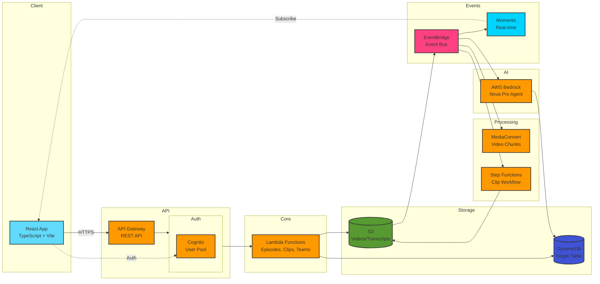
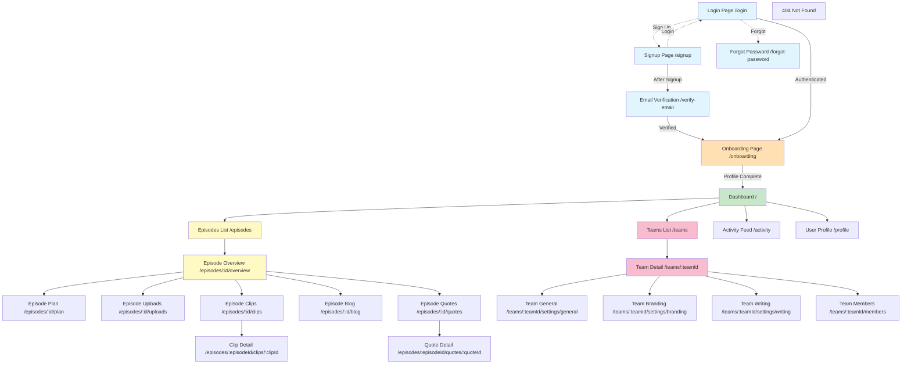
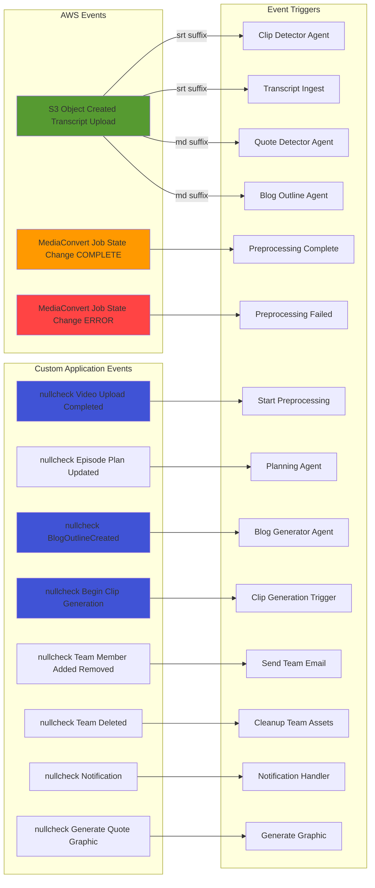
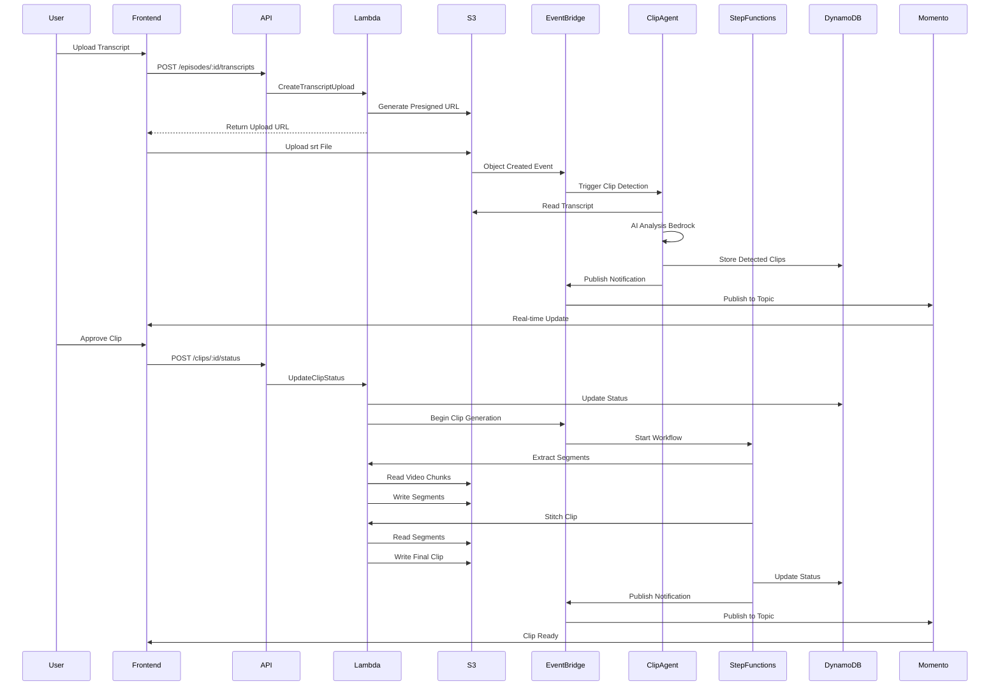
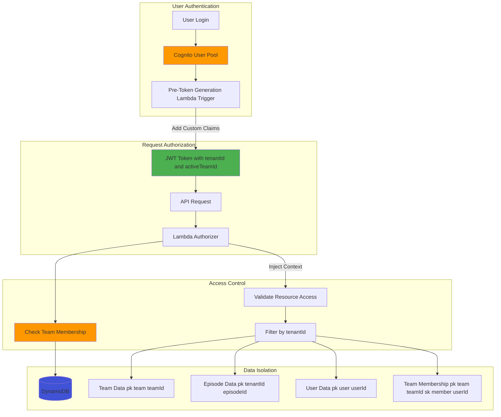

# Architecture Diagrams

## Simplified Architecture (Presentation View)



## 1. Backend Architecture Diagram

```mermaid
graph TB
    subgraph Frontend
        React[React App - Vite TypeScript]
    end

    subgraph Authentication
        Cognito[AWS Cognito User Pool]
        Authorizer[Lambda Authorizer JWT Validation]
    end

    subgraph APILayer[API Layer]
        APIGW[API Gateway REST API]
    end

    subgraph CoreServices[Core Services]
        Episodes[Episode Functions CRUD]
        Clips[Clip Functions Management]
        Quotes[Quote Functions Management]
        Teams[Team Functions Multi-tenant]
        Users[User Functions Profile]
        Notifications[Notification Functions]
    end

    subgraph AIAgents[AI Agents]
        ClipDetector[Clip Detector Agent Bedrock Nova Pro]
        QuoteDetector[Quote Detector Agent Bedrock Nova Pro]
        BlogOutline[Blog Outline Agent Bedrock Nova Pro]
        BlogGenerator[Blog Generator Agent Bedrock Nova Pro]
        PlanningAgent[Planning Agent Bedrock Nova Pro]
    end

    subgraph EventProcessing[Event Processing]
        TranscriptIngest[Transcript Ingest Speaker Analysis]
        StartPreprocess[Start Preprocessing MediaConvert]
        PreprocessComplete[Preprocessing Complete Chunks]
        PreprocessFailed[Preprocessing Failed Errors]
        ClipGenTrigger[Clip Generation Trigger Step Functions]
        NotificationHandler[Notification Handler Momento]
    end

    subgraph VideoProcessing[Video Processing]
        MediaConvert[AWS MediaConvert Video Chunking]
        StepFunctions[Step Functions Clip Workflow]
        SegmentExtractor[Segment Extractor FFmpeg]
        ClipStitcher[Clip Stitcher FFmpeg]
    end

    subgraph DataStorage[Data Storage]
        DynamoDB[(DynamoDB Single Table)]
        S3[(S3 Bucket Videos Transcripts)]
        BedrockMemory[Bedrock Agent Memory AI Context]
    end

    subgraph Realtime[Real-time]
        Momento[Momento Topics PubSub]
        EventBridge[EventBridge Event Bus]
    end

    React -->|HTTPS| APIGW
    React -->|Auth| Cognito
    APIGW -->|Authorize| Authorizer
    Authorizer -->|Validate| Cognito
    Authorizer -->|Check Team| DynamoDB

    APIGW --> Episodes
    APIGW --> Clips
    APIGW --> Quotes
    APIGW --> Teams
    APIGW --> Users
    APIGW --> Notifications

    Episodes --> DynamoDB
    Episodes --> S3
    Clips --> DynamoDB
    Clips --> S3
    Quotes --> DynamoDB
    Quotes --> S3
    Teams --> DynamoDB
    Users --> DynamoDB
    Notifications --> DynamoDB

    S3 -->|Object Created| EventBridge
    EventBridge -->|Transcript srt| ClipDetector
    EventBridge -->|Transcript md| QuoteDetector
    EventBridge -->|Transcript md| BlogOutline
    EventBridge -->|BlogOutlineCreated| BlogGenerator
    EventBridge -->|Transcript srt| TranscriptIngest

    ClipDetector --> BedrockMemory
    ClipDetector --> DynamoDB
    QuoteDetector --> BedrockMemory
    QuoteDetector --> DynamoDB
    BlogOutline --> BedrockMemory
    BlogOutline --> DynamoDB
    BlogGenerator --> DynamoDB
    PlanningAgent --> BedrockMemory
    PlanningAgent --> DynamoDB

    TranscriptIngest -->|Video Upload Complete| EventBridge
    EventBridge -->|Video Upload Complete| StartPreprocess
    StartPreprocess --> MediaConvert
    MediaConvert -->|Job Complete| EventBridge
    EventBridge -->|Job Complete| PreprocessComplete
    EventBridge -->|Job Failed| PreprocessFailed
    PreprocessComplete --> DynamoDB

    EventBridge -->|Begin Clip Generation| ClipGenTrigger
    ClipGenTrigger --> StepFunctions
    StepFunctions --> SegmentExtractor
    SegmentExtractor --> S3
    StepFunctions --> ClipStitcher
    ClipStitcher --> S3
    StepFunctions --> DynamoDB

    EventBridge -->|Notification| NotificationHandler
    NotificationHandler --> Momento
    Momento -->|Subscribe| React

    style React fill:#61dafb
    style Cognito fill:#ff9900
    style APIGW fill:#ff9900
    style DynamoDB fill:#4053d6
    style S3 fill:#569a31
    style EventBridge fill:#ff9900
    style Momento fill:#00d4ff
    style MediaConvert fill:#ff9900
    style StepFunctions fill:#ff9900
    style BedrockMemory fill:#ff9900
```



## 2. Frontend Page Map



## 3. Event List



## 4. Frontend to Backend Trigger Map

```mermaid
graph TB
    subgraph FrontendActions[Frontend Actions]
        CreateEp[Create Episode]
        UpdateEp[Update Episode]
        UploadTranscript[Upload Transcript]
        UploadTrack[Upload Video Track]
        UpdateStatus[Update Episode Status]
        ApproveClip[Approve Clip]
        CreateQuote[Create Quote]
        GenQuoteGraphic[Generate Quote Graphic]
        CreateTeam[Create Team]
        InviteMember[Invite Team Member]
        UpdateProfile[Update User Profile]
        GenBlog[Generate Blog]
        CreatePlan[Create Episode Plan]
        SkipPlan[Skip Plan Generation]
    end

    subgraph APIEndpoints[API Endpoints]
        PostEpisode[POST /episodes]
        PutEpisode[PUT /episodes/:id]
        PostTranscript[POST /episodes/:id/transcripts]
        PostTrack[POST /episodes/:id/tracks]
        PostStatus[POST /episodes/:id/statuses]
        PostClipStatus[POST /episodes/:id/clips/:clipId/status]
        PostQuote[POST /episodes/:id/quotes]
        PostQuoteGraphic[POST /episodes/:id/quotes/:quoteId/graphic]
        PostTeam[POST /teams]
        PostInvite[POST /teams/:id/members]
        PutProfile[PUT /users/profile]
        PostBlog[POST /episodes/:id/blog/regenerate]
        PostPlan[POST /episodes/:id/plan]
        PostSkipPlan[POST /episodes/:id/plan/skip]
    end

    subgraph LambdaFunction
rofileFunction]
        RegenerateBlogFn[RegenerateBlogFunction]
        AddPlanFn[AddPlanFunction]
        SkipPlanFn[SkipPlanGenerationFunction]
    end

    subgraph EventDriven[Event-Driven Processing]
        S3Upload[S3 Upload Event]
        ClipDetection[Clip Detector Agent]
        QuoteDetection[Quote Detector Agent]
        VideoPreprocess[MediaConvert Job]
        ClipWorkflow[Step Functions Workflow]
        BlogGeneration[Blog Generator Agent]
        PlanGeneration[Planning Agent]
        EmailSend[Send Team Email]
        MomentoPublish[Momento Notification]
    end

    CreateEp --> PostEpisode --> CreateEpFn
    UpdateEp --> PutEpisode --> UpdateEpFn
    UploadTranscript --> PostTranscript --> CreateTranscriptFn
    CreateTranscriptFn --> S3Upload
    S3Upload --> ClipDetection
    S3Upload --> QuoteDetection

    UploadTrack --> PostTrack --> CreateTrackFn
    CreateTrackFn --> VideoPreprocess

    UpdateStatus --> PostStatus --> UpdateStatusFn
    UpdateStatusFn -.->|Status Ready| ClipWorkflow

    ApproveClip --> PostClipStatus --> UpdateClipStatusFn
    UpdateClipStatusFn --> ClipWorkflow

    CreateQuote --> PostQuote --> CreateQuoteFn
    GenQuoteGraphic --> PostQuoteGraphic --> GenGraphicFn

    CreateTeam --> PostTeam --> CreateTeamFn
    InviteMember --> PostInvite --> AddMemberFn
    AddMemberFn --> EmailSend
    AddMemberFn --> MomentoPublish

    UpdateProfile --> PutProfile --> UpdateProfileFn

    GenBlog --> PostBlog --> RegenerateBlogFn
    RegenerateBlogFn --> BlogGeneration

    CreatePlan --> PostPlan --> AddPlanFn
    AddPlanFn --> PlanGeneration

    SkipPlan --> PostSkipPlan --> SkipPlanFn

    style CreateEp fill:#e1f5ff
    style UploadTranscript fill:#e1f5ff
    style ApproveClip fill:#e1f5ff
    style PostEpisode fill:#fff9c4
    style CreateEpFn fill:#c8e6c9
    style ClipDetection fill:#f8bbd0
    style ClipWorkflow fill:#f8bbd0
```

## 5. Data Flow - Clip Generation Workflow



## 6. Multi-Tenant Architecture


